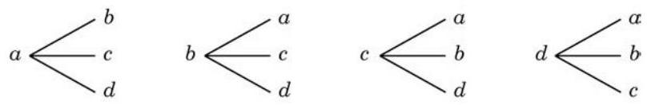

# 例题卡：例 1 写出从 $a\text{ 、 }b\text{ 、 }c\text{ 、 }d$ 四个元素中任取两个不同元素的所有排列.

例 1 写出从 $a\text{ 、 }b\text{ 、 }c\text{ 、 }d$ 四个元素中任取两个不同元素的所有排列.

解 先画出下面的树形图 (图 6-2-2): 于是可知,所有的排列是 ${ab}\text{ 、 }{ac}\text{ 、 }{ad}\text{ 、 }{ba}\text{ 、 }{bc}\text{ 、 }{bd}\text{ 、 }{ca}\text{ 、 }{cb}$ 、 ${cd}\text{ 、 }{da}\text{ 、 }{db}\text{ 、 }{dc}.$

