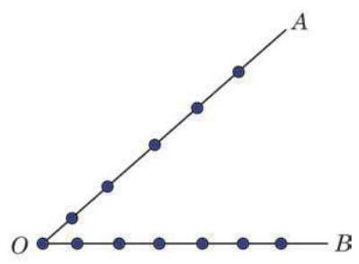

# 概念卡：B 组

1. 把 5 本不同的书全部分给 3 名学生, 每人至少 1 本, 有多少种不同的分法?

2. 袋中装有 $m$ 个红球和 $n$ 个白球,且 $m \geq  n \geq  2$ . 这些红球和白球的大小及质地都相同. 从袋中同时任取 2 个球, 若 2 个球都是红球的取法总数是 2 个球颜色不同的取法总数的整数倍,求证: $m$ 必为奇数.

3. 如图，在 $\angle {AOB}$ 的两边 ${OA}\text{ 、 }{OB}$ 上分别有 5 个点和 6 个点 (都不同于点 $O$ )，这连同点 $O$ 在内的 12 个点可以确定多少个不同的三角形?

(第 3 题)

4. 有 12 名翻译人员，其中 3 人只能翻译英语，4 人只能翻译法语，其余 5 人既能翻译英语, 也能翻译法语. 从这 12 名翻译人员中任选 6 人，其中 3 人翻译英语，3 人翻译法语, 有多少种不同的选法?

5. 利用组合数的性质化简: ${\mathrm{C}}_{3}^{3} + {\mathrm{C}}_{4}^{3} + {\mathrm{C}}_{5}^{3} + \cdots  + {\mathrm{C}}_{n}^{3}$ .
