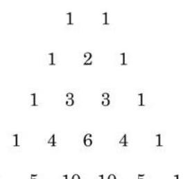
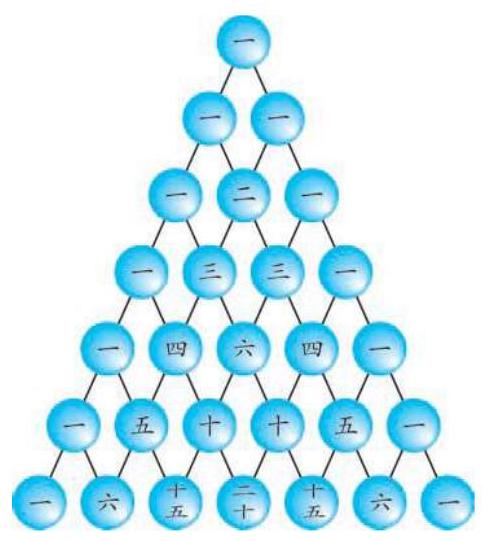

# 定理卡：1 杨辉三角和二项式定理

我们知道,对于任意的 $a\text{ 、 }b$ ,都有

$$
{\left( a + b\right) }^{2} = {a}^{2} + {2ab} + {b}^{2},
$$

$$
{\left( a + b\right) }^{3} = {a}^{3} + 3{a}^{2}b + {3a}{b}^{2} + {b}^{3},
$$

$$
{\left( a + b\right) }^{4} = {a}^{4} + 4{a}^{3}b + 6{a}^{2}{b}^{2} + {4a}{b}^{3} + {b}^{4},
$$

$$
{\left( a + b\right) }^{5} = {a}^{5} + 5{a}^{4}b + {10}{a}^{3}{b}^{2} + {10}{a}^{2}{b}^{3} + {5a}{b}^{4} + {b}^{5}.
$$

我们把等式右边的代数式称为 ${\left( a + b\right) }^{k}$ 的二项展开式,其中 $k = 2,3,4,5$ . 一般地,对于任意正整数 $n,{\left( a + b\right) }^{n}$ 的二项展开式有什么规律呢?

在 $n$ 的取值不大的情况下,也可以利用下面的数阵求 ${\left( a + b\right) }^{n}$ 的二项展开式中各项的系数:

$$
{\left( a + b\right) }^{1}
$$

$$
{\left( a + b\right) }^{2}
$$

$$
{\left( a + b\right) }^{3}
$$

$$
{\left( a + b\right) }^{4}
$$

$$
{\left( a + b\right) }^{5}
$$

$\begin{array}{llllll} 1 & 5 & {10} & {10} & 5 & 1 \end{array}$

这个数阵的特点是: ①每一行的第一个数和最后一个数都是 1 . ②每一行中, 除了第一个数和最后一个数外, 每个数等于它"肩上"的两个数之和. ③当 $n$ 为偶数时,最大的系数是中间一项; 当 $n$ 为奇数时,最大的系数是中间两项.

在我国数学家杨辉于 1261 年所著的《详解九章算法》中出现了类似的图表(类似于图 6-5-1)，习惯上称之为杨辉三角，杨辉在该图旁注明 "贾宪用此术"，故亦称贾宪三角. 它是中国古代数学的杰出研究成果之一.

---

请将特点①和特点②用组合数的公式表示.

杨辉, 字谦光, 钱塘(今杭州)人。中国南宋末年数学家、 数学教育家. 约在 13 世纪中叶至后半叶活动于苏、杭一带.

---

一般地, 我们有下面的
