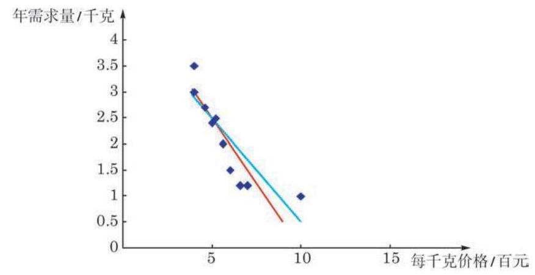

# 方法卡：1 一元线性回归分析的基本思想

对于一组有某种线性关系的成对数据, 上一节介绍的相关系数分析了数据之间线性关系的方向与程度. 但有时我们还需要进一步了解其中一个变量随另一个变量变化的大致情况. 更准确地说, 我们要找到关联两个变量的一个线性方程, 使得在平面直角坐标系上数据所确定的点尽可能地 “贴近” 方程所定义的直线.

先回到本章 8.1 节的例 1. 为了找一条直线去“贴近”数据散点图 (图 8-1-1) 中的各点, 甲、乙两名同学分别给出了线性方程:

甲: $y =  - {0.5x} + {5.0}$ ,

乙: $y =  - {0.4x} + {4.5}$ .

我们在散点图上把这两个线性方程所定义的直线绘制出来, 如图 8-2-1 所示, 其中红色直线是甲的方程所定义的, 蓝色直线是乙的方程所定义的.

凭直觉我们很难断定哪条直线与数据点贴近得更好.

至此, 我们会提出问题: (1)有没有明确的标准来衡量直线与数据点的贴近程度? (2)如果有这样的标准，如何找出在此标准下最佳的直线?

要解决这两个问题, 可以用下面介绍的回归分析的方法.

一般地,设给定一组有线性相关关系的成对数据 $\left( {{x}_{1},{y}_{1}}\right)$ 、 $\left( {{x}_{2},{y}_{2}}\right) \text{ 、 }\cdots \text{ 、 }\left( {{x}_{n},{y}_{n}}\right)$ 和一个线性方程 (或称线性模型)

$$
y = {ax} + b.
$$

①

如何描述数据与此线性方程的贴近度呢?

当变量 $x$ 取值 ${x}_{i}\left( {i = 1,2,\cdots , n}\right)$ 时,令 ${\widehat{y}}_{i} = a{x}_{i} + b$ ,它是变量 $y$ 与 ${x}_{i}$ 对应的理想值. 但数据中的 ${y}_{i}$ 与 ${\widehat{y}}_{i}$ 不一定相同, 它们的差 ${y}_{i} - {\widehat{y}}_{i}$ 称为在 ${x}_{i}$ 处的离差 (dispersion),当 ${y}_{i} - {\widehat{y}}_{i} \geq  0$ 时称为正离差,而当 ${y}_{i} - {\widehat{y}}_{i} < 0$ 时称为负离差. 显然,离差直观地描述了单对数据与线性方程①的贴近度.

由于离差可正可负, 考虑数据整体与线性方程①的贴近度时, 不能简单地用离差的代数和作为指标. 我们可以像计算方差那样, 用离差的平方和

$$
Q = \mathop{\sum }\limits_{{i = 1}}^{n}{\left( {y}_{i} - {\widehat{y}}_{i}\right) }^{2}
$$

来刻画直线与点之间的拟合程度. $Q$ 称为拟合误差 (fitting error), 它是一个很好的描述数据与函数贴合程度的指标. 我们把拟合误差取得最小值时得到的线性方程(线性模型)记为

$$
y = \widehat{a}x + \widehat{b},
$$

②

并称之为变量 $y$ 随 $x$ 波动的回归方程 (regression equation) 或回归模型 (regression model),其中自变量 $x$ 称为解释变量 (explanatory variable),因变量 $y$ 称为反应变量 (response variable). 回归方程所定义的直线称为回归直线 (regression line), 回归方程的系数 (或称回归模型的参数) $\widehat{a}$ 与 $\widehat{b}$ 称为回归系数 (regression coefficients). 由一组有某种线性关系的成对数据求其回归方程的方法称为一元线性回归分析 (regression analysis).

回归系数 $\widehat{a}$ 与 $\widehat{b}$ 的计算公式如下:

$$
\left\{  \begin{array}{l} \widehat{a} = \frac{\mathop{\sum }\limits_{{i = 1}}^{n}\left( {{x}_{i} - \bar{x}}\right) \left( {{y}_{i} - \bar{y}}\right) }{\mathop{\sum }\limits_{{i = 1}}^{n}{\left( {x}_{i} - \bar{x}\right) }^{2}} = \frac{\mathop{\sum }\limits_{{i = 1}}^{n}{x}_{i}{y}_{i} - n\bar{x}\bar{y}}{\mathop{\sum }\limits_{{i = 1}}^{n}{x}_{i}{}^{2} - n{\bar{x}}^{2}}, \\  \widehat{b} = \bar{y} - \widehat{a}\bar{x} = \frac{\mathop{\sum }\limits_{{i = 1}}^{n}{y}_{i} - \widehat{a}\mathop{\sum }\limits_{{i = 1}}^{n}{x}_{i}}{n}, \end{array}\right.
$$

③

其中 $\bar{x}$ 与 $\bar{y}$ 分别是数据 ${x}_{i}$ 与 ${y}_{i}\left( {i = 1,2,\cdots , n}\right)$ 的算术平均值, 数对 $\left( {\bar{x},\bar{y}}\right)$ 称为样本点的中心.

公式③的一个初等的推导过程在本节的课后阅读中介绍. 回归系数 $\widehat{a}$ 与 $\widehat{b}$ 的值只与给定的数据有关，而与回归分析过程中初始选择的线性模型无关.

---

从回归系数公式 ③可以看出，回归直线经过样本点的中心 $\left( {\bar{x},\bar{y}}\right)$ ,也就是散点图中数据点的中心.

---

有了回归系数 $\widehat{a}$ 与 $\widehat{b}$ ,代入方程②就得到了这一组成对数据的回归方程. 这样, 我们对本节开头提的两个问题都有了明确的答案.

我们的回归分析是基于 $Q$ 取最小值的假设,即基于所有离差的平方和取最小值的假设进行的. 这种回归分析的方法称为最小二乘法 (least squares), 由最小二乘法导出的估计量称为最小二乘估计量,所得到的回归系数 $\widehat{a}$ 与 $\widehat{b}$ 又称为模型参数 $a$ 与 $b$ 的最小二乘估计 (least squares estimate).

在解决具体问题时, 如果数据量不大, 可以用上面的公式直接计算出回归系数 $\widehat{a}$ 与 $\widehat{b}$ ,进而得出回归方程. 如果数据量大, 就要借助统计软件, 通过计算机或计算器来实现这一过程了.

下面我们针对本章 8.1 节中的例 1 来求回归方程, 并理解回归直线与观察值之间的关系.

依据表 8-1 给出的某种商品“年需求量”(y)与“每千克价格” (x)之间的一组观察数据以及所得到的散点图 8-1-1，我们已经知道这两个变量形成的数据点大致分布在一条直线的附近，即“年需求量” $\left( y\right)$ 与“每千克价格” $\left( x\right)$ 大致呈线性关系,因而可以用线性回归方程来刻画它们之间的数量关系. 用回归系数的计算公式可求得 $\left\{  \begin{array}{l} \widehat{a} =  - {0.413}, \\  \widehat{b} = {4.495}, \end{array}\right.$ 于是所求的回归方程为

$$
y =  - {0.413x} + {4.495},
$$

这个方程所定义的直线即这组数据的回归直线, 它是给定数据点的最佳拟合直线.

由回归方程,我们可以算出每个 ${x}_{i}$ 对应的计算值 ${\widehat{y}}_{i}$ (结果精确到 0.1 )，列表 8-4 如下:

表 8-4
