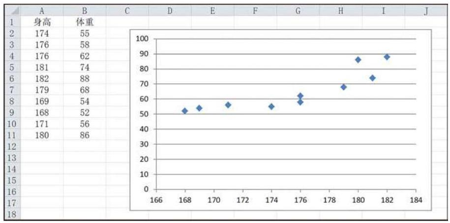
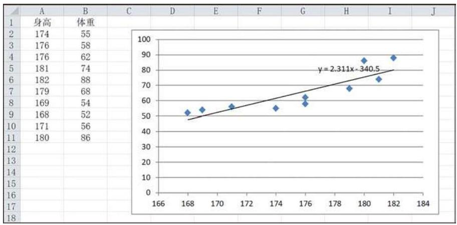

# 例题卡：例 1 依据本章 8.1 节例 2 中某市高中男生身高与体重的抽样数据,运用电子表格办公软件求“体重” $\left( y\right)$ 关于“身高” $\left( x\right)$ 的回归方程.

例 1 依据本章 8.1 节例 2 中某市高中男生身高与体重的抽样数据,运用电子表格办公软件求“体重” $\left( y\right)$ 关于“身高” $\left( x\right)$ 的回归方程.

解 将表 8-3 中的数据输入工作簿，然后选择“插入图表”， 再选择“散点图”，则自动生成如下的散点图 (图 8-2-2).

在数据点上单击右键, 选择 “添加趋势线” 一“线型”, 并在 “趋势线选项”标签中要求给出公式，可以得到回归直线(图 8-2-3).

图 8-2-3 中标明了所求的回归方程为: $y = {2.311x} - {340.5}$ .

根据所得的回归方程,对于身高 ${178}\mathrm{\;{cm}}$ 的男生,可以预测其体重为 ${2.311} \times  {178} - {340.5} = \mathbf{{70}.{858}}\left( \mathrm{\;{kg}}\right)$ .

从上述例子可以看出, 建立一元线性回归模型的一般步骤如下:

(1)确定研究对象，从一组数据出发，根据实际问题，明确哪个变量是自变量, 哪个变量是因变量;

(2)对确定的自变量和因变量，绘制相应的散点图，观察它们之间的关系(如是否存在线性关系等)；

(3)若观察到数据呈线性关系，则选用线性方程 $y = {ax} + b$ ；

(4)利用最小二乘法估计线性方程中的参数 $a\text{ 、 }b$ ，得到回归方程 $y = \widehat{a}x + \widehat{b}$ ；

(5)得出结果后计算离差，采用统计方法检验模型是否合适 (这一步本书不作要求);

(6)利用所求的回归方程进行预测.

相关分析和回归分析作为处理成对数据的两种基本统计方法, 它们之间有如下联系与区别:

(1)相关分析主要测定变量之间相关性的强弱和变化方向， 而回归分析则是在相关分析的基础上建立回归模型, 定量地描述变量间具体的变动关系. 只有在两组变量具有线性相关性时, 才作线性回归分析, 得到回归直线.

(2)在相关分析中，两个变量的地位是对等的; 而在回归分析中, 要考察的是一个变量随另一个变量的变化趋势, 其中自变量是解释变量, 因变量是反应变量.

(3)回归分析具有因果分析和预测的功能，可以分析反应变量受解释变量的影响程度, 也可以通过回归方程求得反应变量的计算值来估计其他同类的观察值.

(4)在相关分析中，一般要求两个变量的总体都满足正态分布；而在回归分析时，一般只要求反应变量的总体满足正态分布.

除了具有线性关系的散点图以外, 线性回归分析还可以处理呈指数分布性状的数据分布. 表 8-5 是 1999 年至 2018 年我国国内游客数量(单位:万人次)的统计表，图 8-2-4 是根据这些数据所作的散点图. 从图上可以看出年份与游客人数之间不是线性关系, 而是有明显的指数增长的性状.

表 8-5
