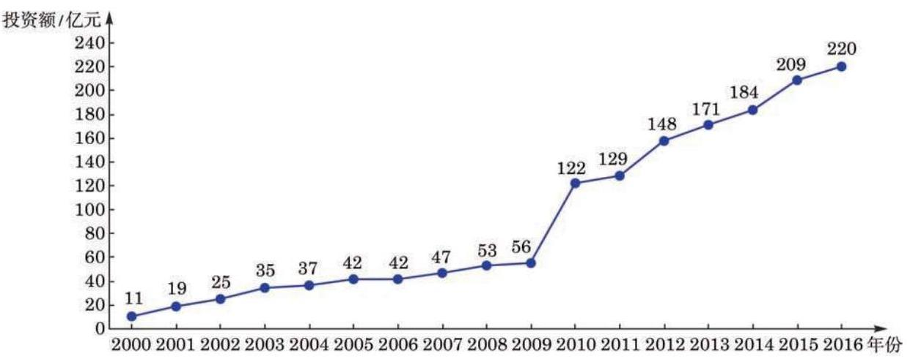

# 概念卡：B 组

1. 某人对一地区近几年的年人均可支配收入 $x$ (单位:千元) 与年人均消费支出 $y$ (单位: 千元)进行统计调查,发现 $y$ 与 $x$ 具有线性相关关系,且得到回归方程 $y = {0.71x} -$ 1.814. 若该地区去年的年人均消费支出为 4 万 3 千元，试估计该地区去年的年人均消费支出占人均可支配收入的百分比.

2. 某连锁日用品销售公司下属 5 个社区便利店某月的销售额与利润额如下表所示.

(1)绘制变量 $y$ 与 $x$ 的散点图；

(2)计算 $y$ 与 $x$ 的相关系数；

(3)试分析研究 $y$ 与 $x$ 之间的线性回归关系.

2. 下图是某地区 2000 年至 2016 年环境基础设施投资额 $y$ (单位:亿元)的折线图.

(第 2 题)

为预测该地区 2018 年的环境基础设施投资额,建立了 $y$ 与时间变量 $t$ 的两个线性回归模型. 其中,根据 2000 年至 2016 年的数据 (时间变量 $t$ 的值依次为 $1,2,\cdots ,{17}$ ) 建立了模型①: $y =  - {30.4} + {13.5t}$ ; 而根据 2010 年至 2016 年的数据 (时间变量 $t$ 的值依次为 $1,2,\cdots ,7)$ 建立了模型②: $y = {99} + {17.5t}$ .

(1)分别利用这两个模型，求该地区 2018 年环境基础设施投资额的预测值；

(2)你认为用哪个模型得到的预测值更可靠？请说明理由.

3. 某地区市场上有 80 种品牌的饼干, 它们近一段时间内的平均售价 (以下简称“价格”)和销售量的数据如下表所示.

<table id="cross-table-4"><tr><td>品牌编号</td><td>价格/(元/千克)</td><td>销售量/千克</td><td>品牌编号</td><td>价格/(元/千克)</td><td>销售量/千克</td></tr><tr><td>1</td><td>14</td><td>1231.85</td><td>23</td><td>31.41</td><td>5865.45</td></tr><tr><td>2</td><td>34.62</td><td>1465.89</td><td>24</td><td>23.48</td><td>6103.94</td></tr><tr><td>3</td><td>30.86</td><td>1774.29</td><td>25</td><td>23.6</td><td>6 243.10</td></tr><tr><td>4</td><td>14</td><td>1892.91</td><td>26</td><td>22.13</td><td>6509.67</td></tr><tr><td>5</td><td>36</td><td>2324.44</td><td>27</td><td>21.48</td><td>6758.18</td></tr><tr><td>6</td><td>28.41</td><td>2480.04</td><td>28</td><td>25.03</td><td>7100.93</td></tr><tr><td>7</td><td>9.09</td><td>2545.33</td><td>29</td><td>19.55</td><td>7356.44</td></tr><tr><td>8</td><td>44.84</td><td>2568.11</td><td>30</td><td>24.81</td><td>7439.63</td></tr><tr><td>9</td><td>31.68</td><td>2638.48</td><td>31</td><td>20.92</td><td>7627.28</td></tr><tr><td>10</td><td>20</td><td>3233.99</td><td>32</td><td>17.7</td><td>7740.45</td></tr><tr><td>11</td><td>14.67</td><td>3518.17</td><td>33</td><td>20.79</td><td>7744.67</td></tr><tr><td>12</td><td>19.09</td><td>3566.58</td><td>34</td><td>24.63</td><td>7 989.30</td></tr><tr><td>13</td><td>26.67</td><td>4264.28</td><td>35</td><td>13.59</td><td>7996.84</td></tr><tr><td>14</td><td>17.51</td><td>4672.33</td><td>36</td><td>19.29</td><td>8151.09</td></tr><tr><td>15</td><td>13</td><td>4752.20</td><td>37</td><td>20</td><td>8231.85</td></tr><tr><td>16</td><td>25.24</td><td>4865.42</td><td>38</td><td>22.03</td><td>8289.18</td></tr><tr><td>17</td><td>31.1</td><td>5042.91</td><td>39</td><td>20.08</td><td>8524.06</td></tr><tr><td>18</td><td>26.24</td><td>5108.73</td><td>40</td><td>19.03</td><td>8689.36</td></tr><tr><td>19</td><td>25.88</td><td>5367.70</td><td>41</td><td>16.67</td><td>8874.66</td></tr><tr><td>20</td><td>17.81</td><td>5465.26</td><td>42</td><td>16.04</td><td>8888.74</td></tr><tr><td>21</td><td>29.56</td><td>5 500.35</td><td>43</td><td>14.12</td><td>9005.62</td></tr><tr><td>22</td><td>25</td><td>5 655.53</td><td>44</td><td>13.75</td><td>9046.93</td></tr><tr></tr><tr><td>45</td><td>19.87</td><td>9384.98</td><td>63</td><td>11.89</td><td>15175.16</td></tr><tr><td>46</td><td>15.72</td><td>9414.11</td><td>64</td><td>10.08</td><td>17658.74</td></tr><tr><td>47</td><td>25.04</td><td>9454.50</td><td>65</td><td>6.13</td><td>18058.67</td></tr><tr><td>48</td><td>14</td><td>9731.32</td><td>66</td><td>10.4</td><td>19 937.88</td></tr><tr><td>49</td><td>11.26</td><td>9762.08</td><td>67</td><td>12.7</td><td>23 055.87</td></tr><tr><td>50</td><td>11.25</td><td>9809.51</td><td>68</td><td>9.19</td><td>26 508.14</td></tr><tr><td>51</td><td>20.92</td><td>9924.99</td><td>69</td><td>8</td><td>29 504.40</td></tr><tr><td>52</td><td>16.95</td><td>10101.74</td><td>70</td><td>5.22</td><td>31693.07</td></tr><tr><td>53</td><td>15.38</td><td>10461.08</td><td>71</td><td>9.23</td><td>32 123.53</td></tr><tr><td>54</td><td>13.88</td><td>10 561.53</td><td>72</td><td>7.6</td><td>34732.28</td></tr><tr><td>55</td><td>13.04</td><td>10 960.55</td><td>73</td><td>8.33</td><td>36321.39</td></tr><tr><td>56</td><td>29.33</td><td>11 627.43</td><td>74</td><td>9.25</td><td>36898.25</td></tr><tr><td>57</td><td>4.9</td><td>11838.62</td><td>75</td><td>9.36</td><td>38 343.50</td></tr><tr><td>58</td><td>11.91</td><td>12 303.55</td><td>76</td><td>8.42</td><td>39033.51</td></tr><tr><td>59</td><td>13.9</td><td>12713.01</td><td>77</td><td>6.25</td><td>43832.88</td></tr><tr><td>60</td><td>17.78</td><td>12830.94</td><td>78</td><td>23.01</td><td>112827.40</td></tr><tr><td>61</td><td>17.31</td><td>13 686.17</td><td>79</td><td>8.7</td><td>139 493.10</td></tr><tr><td>62</td><td>12.27</td><td>14 181.94</td><td>80</td><td>12.32</td><td>21 134.65</td></tr></table>

试对这 80 种品牌饼干近一段时间内的价格和销售量进行回归分析.
