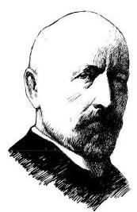

# 概念卡：1 集合的概念

康托(G. Cantor, 1845- 1918), 德国数学家, 集合论创始人.

我们经常需要把满足一定要求或具有一定特征的对象放在一起或归为一类. 例如:

(1)申辉中学高一(1)班的全体学生；

(2)所有不大于 100 的自然数；

(3)直线 $l$ 上的所有点；

(4)不等式 ${2x} + 1 \leq  0$ 的所有解;

(5)太阳系的所有行星.

概括地说, 把一些确定的对象的全体叫做集合 (set), 简称集. 集合通常用大写字母 $A\text{ 、 }B\text{ 、 }C\cdots \cdots$ 表示.

集合所含的各个对象叫做该集合的元素 (element). 元素通常用小写字母 $a\text{ 、 }b\text{ 、 }c\cdots \cdots$ 表示.

如果 $a$ 是集合 $A$ 的元素，就记作 $a \in  A$ ，读作“ $a$ 属于 $A$ ”； 如果 $a$ 不是集合 $A$ 的元素，就记作 $a \notin  A$ ，读作“ $a$ 不属于 $A$ ”. 例如,若 $A$ 是由数 $1\text{ 、 }3\text{ 、 }5\text{ 、 }7\text{ 、 }9$ 组成的集合,则 $1 \in  A,2 \notin  A$ .

集合的元素是确定的. 也就是说, 给定一个集合, 一个对象在不在这个集合中就确定了. 例如, “我国的直辖市”组成一个集合, 北京、上海、天津、重庆在这个集合中, 而杭州、南京、深圳等城市不在这个集合中.

一些不确定的对象不能组成一个集合. 例如, “我们班里高个子的同学”不能组成一个集合. 因为“高个子”的标准不够明确、 具体, 所以 “我们班里高个子的同学” 是不确定的.

一个给定集合中的各个元素是互不相同的, 即一个元素在同一个集合中是不能重复出现的.

如果两个集合 $A$ 与 $B$ 的组成元素完全相同,就称这两个集合相等,记作 $A = B$ .

元素个数有限的集合称为有限集, 否则就称为无限集.
