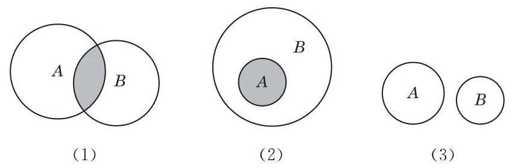

# 概念卡：4 集合的运算

先看一个校园生活的例子. 申辉中学高一年级的学生报名参加数学建模社与理学社. 这样, 除该校高一年级的全体学生组成的集合 $U$ 外,还有参加数学建模社的学生组成的集合 $A$ ,参加理学社的学生组成的集合 $B$ ,两个社都参加的学生组成的集合 $C$ ,两个社中至少参加一个的学生组成的集合 $D$ ,还有未参加数学建模社的学生组成的集合 $E$ ,等等.

可以看到,集合 $A\text{ 、 }B\text{ 、 }C\text{ 、 }D\text{ 、 }E$ 等都是集合 $U$ 的子集, 集合 $C$ 是由集合 $A$ 与 $B$ 的公共元素组成的,集合 $D$ 是由集合 $A$ 与 $B$ 的所有元素组成的,集合 $E$ 是由集合 $U$ 中去掉 $A$ 中的元素后剩下的元素组成的.

---

当集合 $U\text{ 、 }A\text{ 、 }B$ 确定时, 如何确定集合 $C\text{ 、 }D\text{ 、 }E$ 呢?

---

本节我们要从已知的集合出发，通过“交”“并”“补”的运算得到新的集合.

首先, 我们可以对任意两个集合取公共元素, 从而得到一个新的集合.

定义 由既属于集合 $A$ 又属于集合 $B$ 的所有元素组成的集合,叫做集合 $A$ 与 $B$ 的交集(intersection),记作 $A \cap  B$ (读作“ $A$ 交 $B$ ”),即

$$
A \cap  B = \{ x \mid  x \in  A\text{ 且 }x \in  B\} .
$$

可以用文氏图直观地反映 $A \cap  B$ 的几种不同情况,如图 1-1-4 所示.

图 1-1-4(1)表示集合 $A$ 与 $B$ 既有公共元素又都有非公共元素的情况,此时阴影部分 $A \cap  B$ 既是 $A$ 的真子集又是 $B$ 的真子集; 图 1-1-4(2) 表示集合 $A$ 是 $B$ 的子集的情况,此时 $A \cap  B = A$ ; 图 1-1-4(3)表示集合 $A$ 与 $B$ 没有公共元素的情况, 此时 $A \cap  B = \varnothing$ .
