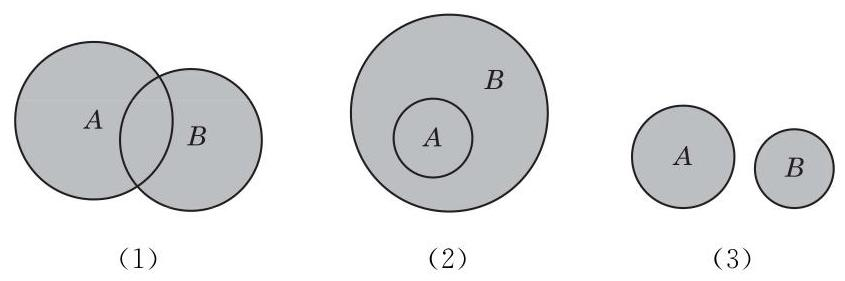

# 例题卡：例 9 已知集合

例 9 已知集合

$$
A = \{ \left( {x, y}\right)  \mid  {2x} + y = 5\} , B = \{ \left( {x, y}\right)  \mid  {3x} + {2y} = 8\} .
$$

求 $A \cap  B$ .

解 由题意, $\left( {x, y}\right)  \in  A \cap  B$ 表示 $\left( {x, y}\right)$ 既属于 $A$ 又属于 $B$ ,即 $\left( {x, y}\right)$ 是方程组

$$
\left\{  \begin{array}{l} {2x} + y = 5 \\  {3x} + {2y} = 8 \end{array}\right.
$$

的解,所以 $x = 2, y = 1$ . 于是, $A \cap  B = \{ \left( {2,1}\right) \}$ .

其次, 我们可以把两个已知集合的所有元素放在一起组成一个新的集合.

定义 由所有属于集合 $A$ 或属于集合 $B$ 的元素所组成的集合,叫做集合 $A$ 与 $B$ 的并集 (union),记作 $A \cup  B$ (读作“ $A$ 并 B”), 即

$$
A \cup  B = \{ x \mid  x \in  A\text{ 或 }x \in  B\} .
$$

可以用文氏图直观地反映 $A \cup  B$ 的几种不同情况,如图 1-1-5所示,其中阴影部分表示 $A \cup  B$ .

---

对照图 1-1-4 的三种情况，请各举一实例.
