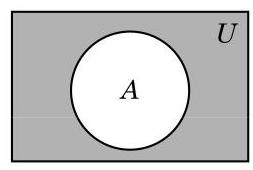

# 例题卡：例 11 已知集合 $A = \{ 1,2\}$ ，求所有满足 $A \cup  B = \{ 1,2,3\}$ 的集合 $B$ .

例 11 已知集合 $A = \{ 1,2\}$ ，求所有满足 $A \cup  B = \{ 1,2,3\}$ 的集合 $B$ .

解 因为 $B \subseteq  A \cup  B = \{ 1,2,3\}$ ,所以 $B$ 的元素只能在 1、2、3 中取. 为了使得 $A \cup  B$ 中有 3,3 必须是 $B$ 的一个元素. 至于 1、2 是否为 $B$ 的元素，不会影响 $A \cup  B$ 的结果.

因此，满足条件的集合 $B$ 一共有 4 个: $\{ 3\} ,\{ 1,3\}$ ， $\{ 2,3\} ,\{ 1,2,3\}$ .

最后, 我们介绍全集与补集.

在数学研究中, 所研究的对象往往是某个确定集合的一个子集或元素. 例如, 求方程的实数解时, 所有解组成的集合一定是实数集 $\mathbf{R}$ 的一个子集; 求三角形的内角的大小时,如果以度 $\left( {}^{ \circ  }\right)$ 为单位, 那么角的度数一定是开区间 $\left( {0,{180}}\right)$ 中的一个元素; 等等. 这个确定的集合称为全集 (universal set),常用符号 $U$ 表示. 它含有我们所要研究问题的全部可能的元素.

定义 设 $U$ 为全集, $A$ 是 $U$ 的子集. 由 $U$ 中所有不属于 $A$ 的元素组成的集合称为集合 $A$ 在全集 $U$ 中的补集 (complementary set),记作 $\bar{A}$ (读作“ $A$ 补”),即

$$
\bar{A} = \{ x \mid  x \in  U\text{ 且 }x \notin  A\} .
$$

有时为了强调全集 $U$ ,集合 $A$ 在全集 $U$ 中的补集 $\bar{A}$ 也可以记作 ${\complement }_{U}A$ .

当全集为实数集 $\mathbf{R}$ 时,有理数集 $\mathbf{Q}$ 的补集 $\overline{\mathbf{Q}}$ 就是全体无理数组成的集合.

可以用文氏图直观地反映 $\bar{A}$ ，如图 1-1-7，其中阴影部分表示集合 $A$ 在全集 $U$ 中的补集 $\bar{A}$ .
