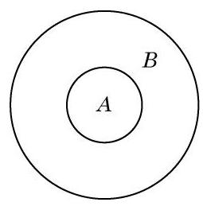

# 概念卡：3 集合之间的关系

考察以下四组集合:

(1)C 是申辉中学高一(1)班的全体学生组成的集合，D 是申辉中学全体学生组成的集合;

(2)C是一平面上所有矩形组成的集合，D 是该平面上所有平行四边形组成的集合;

(3) $C = \{ 2,3\} , D = \left\{  {x \mid  {x}^{2} - {5x} + 6 = 0}\right\}$ ；

(4) $C = \{ x \mid  x = {2k} + 1, k \in  \mathbf{Z}\} , D = \{ x \mid  x$ 是奇数 $\}$ .

容易发现,在上述每组集合中,集合 $C$ 中的每个元素都属于集合 $D$ . 两个集合之间的这种关系是十分常见的.

定义 对于两个集合 $A$ 与 $B$ ,如果集合 $A$ 的每个元素都是集合 $B$ 的元素,那么集合 $A$ 叫做集合 $B$ 的子集 (subset),记作 $A \subseteq  B$ (或 $B \supseteq  A$ ),读作“ $A$ 包含于 $B$ ”(或“ $B$ 包含 $A$ ”).

对任何集合 $A$ ,规定

$$
\varnothing  \subseteq  A\text{ . }
$$

我们常用文氏图 (Venn diagram) 来直观表示集合以及集合之间的关系. 图 1-1-3 是 $A \subseteq  B$ 的文氏图.

上述四组集合中的每组都有 $C \subseteq  D$ . 但是,第 (1)(2)组与第 (3)(4)组是有区别的. 在第(1)(2)组中，集合 $D$ 中有些元素不属于集合 $C$ ,即 $D$ 不是 $C$ 的子集; 而在第(3)(4)组中,集合 $D$ 中的每个元素都属于集合 $C$ ,即 $D \subseteq  C$ .

对于集合之间的包含关系, 我们有下列结论:

(1) $A \subseteq  A$ ；

(2)若 $A \subseteq  B$ 且 $B \subseteq  A$ ，则 $A = B$ ；

---

集合关系中的“若 $A \subseteq  B$ 且 $B \subseteq  A$ ,则 $A \; = B$ ”与实数大小关系中“若 $a \leq  b$ 且 $b \leq  a$ , 则 $a = b$ ” 类似.

---

(3)传递性:若 $A \subseteq  B$ 且 $B \subseteq  C$ ，则 $A \subseteq  C$ .

由此,对第 (3)(4) 组集合, $C = D$ 成立; 而对第 (1)(2) 组集合, $C = D$ 不成立. 为此,我们引入真子集的概念.

定义 对于两个集合 $A$ 与 $B$ ,如果 $A \subseteq  B$ ,且 $B$ 中至少有一个元素不属于 $A$ (即 $B$ 不是 $A$ 的子集),那么称集合 $A$ 是集合 $B$ 的真子集 (proper subset),记作 $A \subset  B$ (或 $B \supset  A$ ),读作“ $A$ 真包含于 $B$ ”(或“ $B$ 真包含 $A$ ”).

对第(1)(2)组集合， $C \subset  D$ 成立.

对于常用的数集，我们有如下的包含关系:

$$
\mathrm{N} \subset  \mathbf{Z} \subset  \mathrm{Q} \subset  \mathbf{R}.
$$
