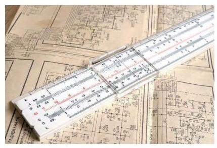

# 方法卡：对数简史

对数是纳皮尔发明的, 其出现事先似乎毫无征兆, 但它绝不是从天上掉下来的, 而是源自当时在天文、航海及工程实践中迫切需要简化大量繁杂计算的实际需要. 纳皮尔从 1594 年到 1614 年花了二十年的时间造出了第一个对数表, 他说过: "要实际应用数学, 我看最大的障碍就是处理很大数字的相乘、相除，或是求取二次或三次方根， $\cdots \cdots$ 因此我开始思考，有没有什么方法可以去除这些障碍. "由于对数不仅能将乘除运算化为加减运算, 而且能将乘方、开方运算化为乘除运算, 一下子将人们从繁复的计算中解放出来, 无异于成倍地延长了科学家与工程技术人员的寿命. 德国天文学家开普勒(J. Kepler)是最早使用对数的人之一, 他成功地在行星轨道的计算中运用了对数. 法国数学家、天文学家拉普拉斯 (P.-S. Laplace) 曾说过:"对数的发明让天文学家的寿命都延长了，因为少做了很多苦工. "恩格斯曾经将解析几何、对数及微积分并列为最重要的数学方法.

在清代初年 (17 世纪中叶) 对数传到了中国，1653 年薛凤柞与波兰人穆尼阁 (J. N. Smogolehshi)共同编译出版了《比例对数表》一书，正式将对数介绍到中国，薛凤柞还将对数应用到历法计算中. 后来, 康熙皇帝组织编撰《数理精蕴》一书，在其下篇・卷三十八"对数比例"一节中，一开始就说:"对数比例乃西士若往·纳白尔(John Napier)所作， 以假数与真数对列成表，故名对数表. "这个假数，我们现在叫"对数"，而若往·纳白尔就是我们现在所述的纳皮尔.

在科学发展的历史中，极少有哪个抽象的数学概念，能像对数一样，一开始就很快受到了整个科学界的热烈欢迎. 对数的发明, 无疑是人类认识史上一个极大的飞跃与革命, 在人类文明的进程中起了划时代的作用. 自纳皮尔 1614 年发明对数以来, 一直到袖珍计算器的出现, 对数以及根据对数的原理所设计的一些计算仪器, 一直是进行复杂计算的有效方法和工具. 根据对数原理设计的计算仪器, 最著名的就是后来为科学家和工程师广泛使用的计算尺, 它在长达 350 年的时间中, 一直是科学家与工程师的忠实伴侣和有力工具. 自 20 世纪 70 年代初期袖珍计算器上市以后, 计算尺才失去市场, 并随着计算机的飞速发展而彻底退出了历史舞台，对数在计算中无可替代的地位也一去而不复返了. 但是, 对数的概念及对数函数的种种性质在众多数学分支及科学领域中至今一直发挥着重要的作用，并且有增无减. 对数从计算的有力工具向科学的重要方法的转化, 在数学的发展史上留下了浓墨重彩的篇章, 记录着人类不断走向文明进步的光辉历程.

