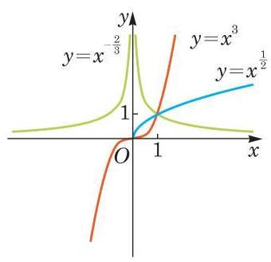

# 概念卡：2 幂函数的性质

由前述,不管指数 $a$ 取何值,当 $x > 0$ 时,幂函数 $y = {x}^{a}$ 总是有定义的,且其函数值 $y > 0$ . 这说明,幂函数 $y = {x}^{a}$ 在第一象限总有图像,其图像随指数 $a$ 取值的不同,可分为两种情况.

(1) $a > 0$ 的情况. 此时观察幂函数 $y = {x}^{a}$ 在第一象限的图像,不难发现,当指数 $0 < a < 1$ 时,相应的图像类似图 4-1-5 中 $y = {x}^{\frac{1}{2}}$ 的图像; 当指数 $a > 1$ 时,相应的图像类似图 4-1-5 中 $y = {x}^{3}$ 的图像; 而当 $a = 1$ 时,幂函数 $y = x$ 的图像是一条经过原点的直线.

---

当 $a = 0$ 时,幂函数 $y = {x}^{0} = 1\left( {x \neq  0}\right)$ 的图像是平行于 $x$ 轴、 并在 $x$ 轴上方一个单位的一条直线(除去点 (0,1)).

当 $a = 1$ 时,幂函数 $y = x$ 的图像是经过原点的一条直线.

---

观察图 4-1-5 所示的幂函数 $y = {x}^{a}\left( {a > 0}\right)$ 在第一象限的图像,可发现图像由左至右是上升的,也就是说,随着自变量 $x$ 的不断增大,函数值 $y$ 也不断增大. 这是因为当 $a > 0$ 时,若 ${x}_{2} > {x}_{1} > 0$ ,则 $\frac{{x}_{2}}{{x}_{1}} > 1$ ,从而由幂的基本不等式,得

$$
{\left( \frac{{x}_{2}}{{x}_{1}}\right) }^{a} > 1
$$

即 ${x}_{2}^{a} > {x}_{1}^{a}$ . 这说明在区间 $\left( {0, + \infty }\right)$ 上幂函数 $y = {x}^{a}\left( {a > 0}\right)$ 的函数值 $y$ 随着 $x$ 的 (严格) 增大而 (严格) 增大. 此时称幂函数 $y = {x}^{a} \; \left( {a > 0}\right)$ 在区间 $\left( {0, + \infty }\right)$ 上是严格增函数.

(2) $a < 0$ 的情况. 此时幂函数 $y = {x}^{a}$ 在第一象限的图像类似图 4-1-5 中 $y = {x}^{-\frac{2}{3}}$ 的图像. 该图像由左至右是下降的,也就是说,在区间 $\left( {0, + \infty }\right)$ 上幂函数 $y = {x}^{a}\left( {a < 0}\right)$ 的函数值 $y$ 随着 $x$ 的 (严格) 增大而 (严格) 减小. 此时称幂函数 $y = {x}^{a}\left( {a < 0}\right)$ 在区间 $\left( {0, + \infty }\right)$ 上是严格减函数.

因为 ${1}^{a} = 1$ ,所以无论 $a > 0$ 还是 $a < 0$ ,幂函数的图像均经过点 $\left( {1,1}\right)$ .
