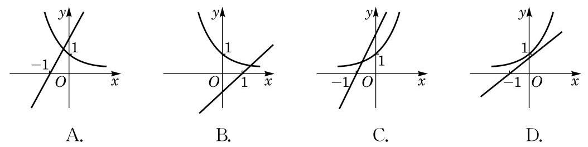
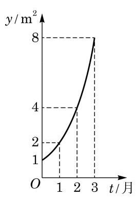

# 概念卡：习题 4.2

##### A 组

1. 下列函数是指数函数的序号为___. (请填入全部正确的序号)

① $y = {\left( -4\right) }^{x}$ ； ② $y = {\left( \frac{1}{4}\right) }^{x}$ ； ③ $y = {4}^{x}$ ； ④ $y = {x}^{-4}$ ； ⑤ $y = {\left( \sqrt{4}\right) }^{x}$ .

2. 求下列函数的定义域:

(1) $y = {2}^{\sqrt{3 - x}}$ ； (2) $y = {0.1}^{\frac{1}{x}}$ .

3. 在同一直角坐标系中作出下列函数的大致图像, 并指出这些函数图像间的关系:

(1) $y = {\left( \frac{3}{2}\right) }^{x}$ ; (2) $y = {\left( \frac{2}{3}\right) }^{x}$ ； (3) $y = {\left( \frac{2}{3}\right) }^{x} - 1$ .

4. 已知指数函数 $y = {\left( m - 2\right) }^{x}$ 在 $\mathbf{R}$ 上是严格减函数,求实数 $m$ 的取值范围.

5. 已知常数 $a > 0$ 且 $a \neq  1$ . 假设无论 $a$ 取何值，函数 $y = {a}^{2 - x}$ 的图像恒经过一个定点， 求此定点的坐标.

6. 比较下列各题中两个数的大小:

(1)1. ${2}^{2.6}$ 和 ${1.2}^{2.61}$ ；

(2) ${\left( \sqrt{3}\right) }^{-\frac{1}{3}}$ 和 ${\left( \frac{\sqrt{3}}{3}\right) }^{\frac{1}{2}}$ .

7. 求下列不等式的解集:

(1) ${3}^{{x}^{2} - {2x} + 3} < {3}^{2x}$ ；

(2) ${\left( \frac{1}{3}\right) }^{\sqrt{x}} \leq  \frac{1}{81}$ .

8. 已知指数函数 $y = {a}^{x}\left( {a > 0\text{ 且 }a \neq  1}\right)$ 在区间 $\left\lbrack  {1,2}\right\rbrack$ 上的最大值与最小值之和等于 6, 求实数 $a$ 的值.

9. 某公司去年购置平板电脑 50 台, 并计划从今年起, 新购置的平板电脑数将按每年 5%的比例增长. 求从今年起的第 10 年新购置的平板电脑数. (结果精确到 1 台)

##### B 组

1. 在同一平面直角坐标系中,指数函数 $y = {a}^{x}\left( {a > 0\text{ 且 }a \neq  1}\right)$ 和一次函数 $y = a\left( {x + 1}\right)$ 的图像关系可能是 ( )

(第 1 题)

(第 2 题)

2. 如图所示的是某池塘中的浮萍蔓延的面积 $y$ (单位: ${\mathrm{m}}^{2}$ ) 与时间 $t$ (单位: 月) 的关系: $y = {a}^{t}\left( {a > 0\text{ 且 }a \neq  1}\right)$ . 以下结论:

① 这个指数函数的底数是 2 ;

② 第 5 个月时，浮萍的面积就会超过 30 ${\mathrm{m}}^{2}$ ；

③ 浮萍面积从 $4{\mathrm{\;m}}^{2}$ 到 ${12}{\mathrm{\;m}}^{2}$ 需要经过 1.5 个月；

④ 浮萍每个月增加的面积都相等.

其中, 正确结论的序号是 ( )

A. ①②③； B. ①②③④；

C. ②③④; D. ①②.

3. 若 $x > 0$ 时,指数函数 $y = {\left( {a}^{2} - 1\right) }^{x}$ 的值总大于 1,求实数 $a$ 的取值范围.

4. 若 $- 1 < x < 0$ ,比较 ${3}^{x},{3}^{-x}$ 及 ${3}^{2x}$ 的大小.

5. 设 $a > 1$ ,若 ${a}^{{x}^{2} + {2x} + 1} < {a}^{2{x}^{2} - {3x} + 1}$ ,求实数 $x$ 的取值范围.

6. 若函数 $y = {5}^{x + 1} + m$ 的图像不经过第二象限,求实数 $m$ 的取值范围.
