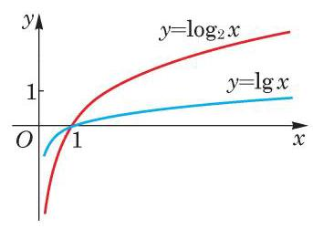

# 例题卡：例 8 现在我们可以回答必修课程 3.2 节一开始提出的问题: 在年利率为 5%，且按年计复利的条件下，1 万元钱存多少年会超过5 万元?

例 8 现在我们可以回答必修课程 3.2 节一开始提出的问题: 在年利率为 5%，且按年计复利的条件下，1 万元钱存多少年会超过5 万元?

解 问题是要找到一个最小的整数 $n$ ,使得

$$
{\left( 1 + {0.05}\right) }^{n} > 5\text{ . }
$$

这等价于 $n > {\log }_{1.05}5$ . 用计算器求精确到五位小数的常用对数值, 可得 $\lg 5 \approx  {0.69897},\lg {1.05} \approx  {0.02119}$ . 由换底公式可得

$$
{\log }_{1.05}5 = \frac{\lg 5}{\lg {1.05}} \approx  \frac{0.69897}{0.02119} \approx  {32.98584}.
$$

所以，存 33 年会超过 5 万元.

最后, 从函数的角度看, 对数的换底公式说的是两个底数不同的对数函数实际上只相差一个常数倍. 事实上,设 $a\text{ 、 }b$ 都是不等于 1 的正数,那么以 $a$ 为底的对数函数 $y = {\log }_{a}x$ 和以 $b$ 为底的对数函数 $y = {\log }_{b}x$ 仅相差一个常数倍,即

$$
{\log }_{b}x = \frac{1}{{\log }_{a}b}{\log }_{a}x, x > 0,
$$

其中,因为 ${\log }_{a}b$ 不包含自变量 $x$ ,在自变量 $x$ 的变化过程中是不变的, 称为常量. 例如,

$$
\lg x = \frac{1}{{\log }_{2}{10}}{\log }_{2}x,
$$

函数 $y = \lg x$ 和 $y = {\log }_{2}x$ 的图像比较如图 4-3-5 所示.
