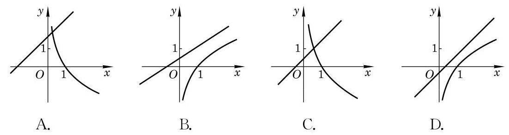

# 概念卡：A 组

1. 填空题:

(1)若点 $\left( {2,\sqrt{2}}\right)$ 在幂函数 $y = {x}^{a}$ 的图像上，则该幂函数的表达式为___； 若点 $\left( {2,\sqrt{2}}\right)$ 在指数函数 $y = {a}^{x}\left( {a > 0\text{ 且 }a \neq  1}\right)$ 的图像上,则该指数函数的表达式为 ; 若点 $\left( {\sqrt{2},2}\right)$ 在对数函数 $y = {\log }_{a}x\left( {a > 0\text{ 且 }a \neq  1}\right)$ 的图像上,则该对数函数的表达式为___.

(2)若幂函数 $y = {x}^{k}$ 在区间 $\left( {0, + \infty }\right)$ 上是严格减函数，则实数 $k$ 的取值范围为___.

(3)已知常数 $a > 0$ 且 $a \neq  1$ ，假设无论 $a$ 为何值，函数 $y = {a}^{x - 2} + 1$ 的图像恒经过一个定点. 则这个点的坐标为___.

2. 选择题:

(1)若指数函数 $y = {a}^{x}\left( {a > 0\text{ 且 }a \neq  1}\right)$ 在 $\mathbf{R}$ 上是严格减函数，则下列不等式中，一定能成立的是 ( )

A. $a > 1$ ; B. $a < 0$ ;

C. $a\left( {a - 1}\right)  < 0$ ; D. $a\left( {a - 1}\right)  > 0$ .

(2)在同一平面直角坐标系中,一次函数 $y = x + a$ 与对数函数 $y = {\log }_{a}x$ ( $a > 0$ 且 $a \neq  1)$ 的图像关系可能是 ( )

(第 2(2)题)

3. 求下列函数的的定义域:

(1) $y = {\left( x - 1\right) }^{\frac{5}{2}}$ ; (2) $y = {3}^{\sqrt{x - 1}}$ ；

(3) $y = \lg \frac{1 + x}{1 - x}$ .

4. 比较下列各题中两个数的大小:

(1) ${0.1}^{0.7}$ 与 ${0.2}^{0.7}$ ； (2) ${0.7}^{0.1}$ 与 ${0.7}^{0.2}$ ；

(3) ${\log }_{0.7}{0.1}$ 与 ${\log }_{0.7}{0.2}$ .

5. 设点 $\left( {\sqrt{2},2}\right)$ 在幂函数 ${y}_{1} = {x}^{a}$ 的图像上,点 $\left( {-2,\frac{1}{4}}\right)$ 在幂函数 ${y}_{2} = {x}^{b}$ 的图像上. 当 $x$ 取何值时, ${y}_{1} = {y}_{2}$ ?

6. 设 $a = {\left( \frac{2}{3}\right) }^{x}, b = {x}^{\frac{3}{2}}$ 及 $c = {\log }_{\frac{2}{3}}x$ ,当 $x > 1$ 时,试比较 $a\text{ 、 }b$ 及 $c$ 之间的大小关系.

7. 设常数 $a > 0$ 且 $a \neq  1$ ,若函数 $y = {\log }_{a}\left( {x + 1}\right)$ 在区间 $\left\lbrack  {0,1}\right\rbrack$ 上的最大值为 1,最小值为 0,求实数 $a$ 的值.

8. 如果光线每通过一块玻璃其强度要减少 ${10}\%$ ,那么至少需要将多少块这样的玻璃重叠起来,才能使通过它们的光线强度低于原来的 $\frac{1}{3}$ ?
