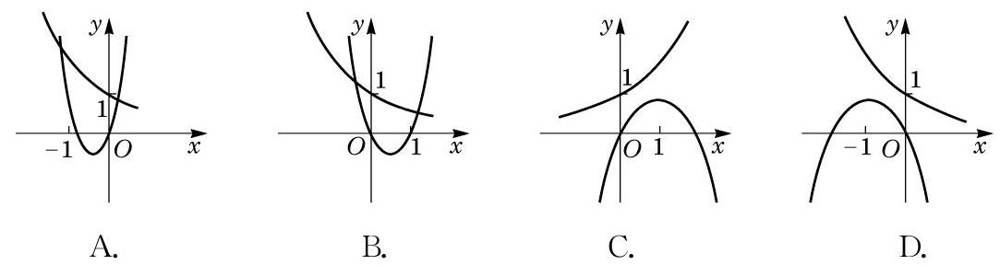

# 概念卡：B 组

1. 填空题:

(1)已知 $m \in  \mathbf{Z}$ ，设幂函数 $y = {x}^{{m}^{2} - {4m}}$ 的图像关于原点成中心对称，且与 $x$ 轴及 $y$ 轴均无交点,则 $m$ 的值为___.

(2)设 $a$ 、 $b$ 为常数，若 $0 < a < 1$ ， $b <  - 1$ ，则函数 $y = {a}^{x} + b$ 的图像必定不经过第象限.

2. 选择题:

(1)若 $m > n > 1$ ,而 $0 < x < 1$ ,则下列不等式正确的是 ( )

A. ${m}^{x} < {n}^{x}$ ; B. ${x}^{m} < {x}^{n}$ ;

C. ${\log }_{x}m > {\log }_{x}n$ ; D. ${\log }_{m}x < {\log }_{n}x$ .

(2)在同一平面直角坐标系中,二次函数 $y = a{x}^{2} + {bx}$ 与指数函数 $y = {\left( \frac{b}{a}\right) }^{x}$ 的图像关系可能为 ( )

(第 2(2)题)

3. 设 $a$ 为常数且 $0 < a < 1$ ,若 $y = {\left( {\log }_{a}\frac{3}{5}\right) }^{x}$ 在 $\mathbf{R}$ 上是严格增函数,求实数 $a$ 的取值范围.

4. 在同一平面直角坐标系中,作出函数 $y = {\left( \frac{1}{2}\right) }^{x}$ 及 $y = {x}^{\frac{1}{2}}$ 的大致图像,并求方程 ${\left( \frac{1}{2}\right) }^{x} = {x}^{\frac{1}{2}}$ 的解的个数.

5. 已知集合 $A = \left\{  {y\left| {\;y = {\left( \frac{1}{2}\right) }^{x}}\right. , x \in  \lbrack  - 2,0)}\right\}$ ，用列举法表示集合 $B = \left\{  {y \mid  y = {\log }_{3}x, x}\right. \; \in  A$ 且 $y \in  \mathbf{Z}\}$ .
