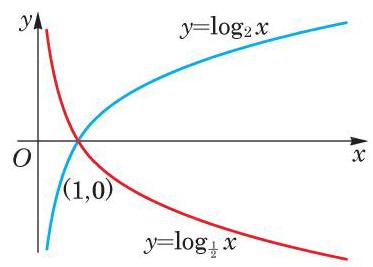
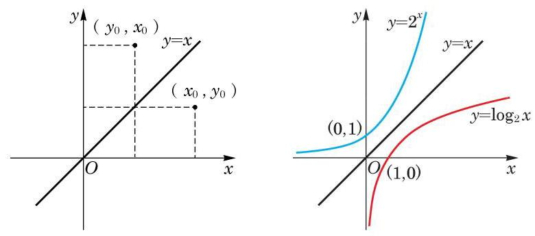

# 定理卡：2 对数函数的性质

由上述,对数函数的图像可分为两种情况:

(1) $a > 1$ 的情况. 此时，对数函数 $y = {\log }_{a}x$ 的图像类似图 4-3-1中 $y = {\log }_{2}x$ 的图像. 当 $x > 1$ 时,函数值大于零,其图像在 $x$ 轴的上方; 而当 $0 < x < 1$ 时,函数值小于零,其图像在 $x$ 轴的下方.

(2) $0 < a < 1$ 的情况. 此时，对数函数图像类似图 4-3-2 中 $y = {\log }_{\frac{1}{2}}x$ 的图像. 当 $x > 1$ 时,函数值小于零,其图像在 $x$ 轴的下方; 当 $0 < x < 1$ 时,函数值大于零,其图像在 $x$ 轴的上方.

这两种情况下的图像可见图 4-3-3 中两个对数函数 $y = {\log }_{2}x$ 与 $y = {\log }_{\frac{1}{2}}x$ 的图像. 它们看上去关于 $x$ 轴对称,实际上也的确如此. 事实上, 由换底公式

$$
{\log }_{a}x =  - {\log }_{{a}^{-1}}x
$$

可得,在 $0 < a < 1$ 时,底 $a$ 小于 1 的对数函数 $y = {\log }_{a}x$ 与底 ${a}^{-1}$ 大于 1 的对数函数 $y = {\log }_{{a}^{-1}}x$ 恰相差一个符号,它们的图像关于 $x$ 轴对称.

因为 ${a}^{0} = 1$ 或者 ${\log }_{a}1 = 0$ ,所有指数函数 $y = {a}^{x}$ 的图像均经过点 $\left( {0,1}\right)$ ,而所有对数函数 $y = {\log }_{a}x$ 的图像均经过点 $\left( {1,0}\right)$ , 所以我们有如下的性质:

对数函数的图像总是经过点 $\left( {1,0}\right)$ .

因为 $y = {\log }_{a}x$ 是 ${a}^{y} = x$ 的解,所以说对数运算是指数运算的一种逆运算. 作为函数,称对数函数 $y = {\log }_{a}x$ 是指数函数 $y = {a}^{x}$ 的反函数.

指数函数 $y = {a}^{x}$ 的图像与其反函数即对数函数 $y = {\log }_{a}x$ 的图像之间有什么关系呢? 它们的关系是: 对数函数 $y = {\log }_{a}x$ 的

---

函数 $y = {\log }_{a}x$ 的图像与 $y = {\log }_{{a}^{-1}}x$ 的图像关于 $x$ 轴对称.

反函数的概念将在下一章学习.

---

图像与指数函数 $y = {a}^{x}$ 的图像关于直线 $y = x$ 是对称的. 这就是说,对数函数 $y = {\log }_{a}x$ 的图像关于直线 $y = x$ 对称的图像就是指数函数 $y = {a}^{x}$ 的图像. 事实上,若点 $\left( {{x}_{0},{y}_{0}}\right)$ 在对数函数 $y = {\log }_{a}x$ 的图像上,就有 ${y}_{0} = {\log }_{a}{x}_{0}$ ,即 ${x}_{0} = {a}^{{y}_{0}}$ . 而点 $\left( {{x}_{0},{y}_{0}}\right)$ 关于直线 $y = x$ 的对称点就是 $\left( {{y}_{0},{x}_{0}}\right)$ ,由于 ${x}_{0} = {a}^{{y}_{0}}$ , 因此 $\left( {{y}_{0},{x}_{0}}\right)$ 必落在指数函数 $y = {a}^{x}$ 的图像上. 反之亦然. 如图 4-3-4所示.

观察图 4-3-1 中的两个对数函数图像, 它们的底都大于 1, 且都是递增的,即在自变量 $x$ 增大时,函数值 $y$ 也增大. 这点在理论上也可以证明. 为此, 先证明下面的定理.
