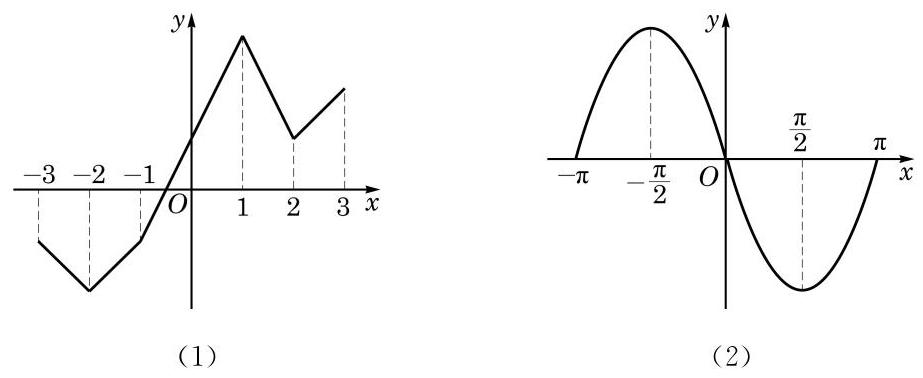

# 练习卡：练习 5.2(4)

1. 根据下列函数 $y = f(x)$ 的图像（包括端点），分别指出这两个函数的单调区间，以及在每一个单调区间上函数的单调性。

**(第 1 题)**

2. 判断函数 $y = |x + 1|, x \in [-2, 2]$ 的单调性，并求出其单调区间。

3. 设 $y = f(x)$ 是奇函数，且它在区间 $(-3, 0]$ 上是严格增函数。

(1) 求证：它在区间 $[0, 3)$ 上是严格增函数；

(2) $y = f(x)$ 是否在区间 $(-3, 3)$ 上是严格增函数？说明理由。
