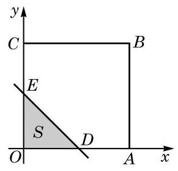

# 方法卡：1 函数关系的建立

**图 5-3-1**

在研究某些数学问题时，所研究的变量往往依赖于另一个变量，此时就需要建立这两个变量之间的函数关系。

**例 1** 如图 5-3-1，一个边长为 $a$、$b$（$a < b$）的长方形被分别平行于长与宽的两条直线所分割，试用解析法将图中阴影部分的总面积 $S$ 表示为 $x$ 的函数。

**解** 因为左上角阴影部分的面积 $S_1 = x^2$，而右下角阴影部分的面积 $S_2 = (a - x)(b - x)$，所以阴影部分的总面积

$$S = S_1 + S_2 = x^2 + (a - x)(b - x)。$$

**图 5-3-2**

因此，所求函数为 $S = 2x^2 - (a + b)x + ab, x \in (0, a)$。

**例 2** 如图 5-3-2，四边形 $OABC$ 是平面直角坐标系中边长为 1 的正方形。一直线 $y = -x + t$（$t \in (0, 2)$）与正方形 $OABC$ 相交，将正方形分为两个部分，其中包含原点 $O$ 的部分的面积记为 $S$。试将 $S$ 表示为 $t$ 的函数。

**解** $t$ 是直线 $y = -x + t$ 在 $y$ 轴上的截距。

**图 5-3-3**

情形一：当 $0 < t \leq 1$ 时，设该直线与线段 $OC$ 交于点 $E$，并与线段 $OA$ 交于点 $D$，如图 5-3-3 所示。

此时，包含点 $O$ 的部分是直角三角形 $ODE$。由于 $OD = OE = t$，因此

$$S = \frac{1}{2}OD \cdot OE = \frac{1}{2}t^2。$$

**图 5-3-4**

情形二：当 $1 < t < 2$ 时，设该直线与线段 $BC$ 交于点 $E$，并与线段 $AB$ 交于点 $D$，如图 5-3-4 所示。

此时，包含点 $O$ 的部分是五边形 $OADEC$，它可以看成是正方形 $OABC$ 除去直角三角形 $BDE$ 所得的部分，由于 $BD = BE = 2 - t$，因此

$$S = OA \cdot OC - \frac{1}{2}BD \cdot BE = 1 - \frac{1}{2}(2 - t)^2 = -\frac{1}{2}t^2 + 2t - 1。$$

综上所述，可以分段表示 $S$ 关于 $t$ 的函数如下：

$$S = \begin{cases} \frac{1}{2}t^2, & 0 < t \leq 1, \\ -\frac{1}{2}t^2 + 2t - 1, & 1 < t < 2. \end{cases}$$

当我们用数学方法解决实际问题时，首先要把问题中的有关变量及其关系表示出来，这显示了建立变量之间的函数关系的重要性。

**例 3** 要建造一面靠墙、且面积相同的两间相邻的长方形居室，如图 5-3-5 所示。如果已有材料可建成的围墙总长度为 $30 \mathrm{m}$，那么当宽 $x$（单位：m）为多少时，才能使所建造的居室总面积最大？居室的最大总面积是多少？

**图 5-3-5**

**解** 由题意，应有 $0 < x < 10$。

如果把建筑材料全部用完，那么此两间居室的总长应为 $(30 - 3x) \mathrm{m}$。

设居室的总面积为 $y \mathrm{m}^2$，则

$$y = x(30 - 3x) = -3(x - 5)^2 + 75, 0 < x < 10。$$

所以，当居室的宽为 $5 \mathrm{m}$ 时，其总面积最大，且最大总面积为 $75 \mathrm{m}^2$。

**例 4** 某小区要建造一个直径为 $16 \mathrm{m}$ 的圆形喷水池，并在池的周边靠近水面的位置安装一圈喷水头，使喷出的水柱在离池中心 $3 \mathrm{m}$ 的地方达到最高高度 $4 \mathrm{m}$。各方向喷来的水柱在池中心上方某一点汇合，求该点离水面的高度。

**解** 过水池的中心任取一个竖直截面，如图 5-3-6 所示。根据力学的原理，喷出的水珠轨迹应为一条抛物线，此抛物线上任何一个点距池中心的水平距离与其所处的高度之间是对应的。为了建立水平距离 $x$（单位：m）与离水面的高度 $y$（单位：m）之间的函数关系 $y = f(x)$，建立如图 5-3-6 所示的直角坐标系。

**图 5-3-6**

设图中右半部分的曲线所对应的函数表达式为

$$y = -a(x - b)^2 + c, 0 \leq x \leq 8，$$

其中点 $(b, c)$ 是此抛物线的顶点。由题意，可得 $b = 3, c = 4$。

又由 $f(8) = 0$，解得 $a = 0.16$。

这样，该汇合点离水面的高度应为

$$h = f(0) = -0.16 \times (0 - 3)^2 + 4 = 2.56 (\mathrm{m})。$$
