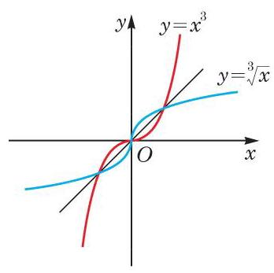

# 公式卡：2 反函数的图像

为了研究函数与其反函数的图像的特征，我们需要一个如下的命题：

**命题** 在平面直角坐标系中，点 $P(a, b)$ 与点 $P'(b, a)$ 关于直线 $y = x$ 成轴对称。

**证明** 当 $a = b$ 时，点 $P$ 与 $P'$ 重合，且在直线 $y = x$ 上，结论成立。

当 $a \neq b$ 时，点 $P$ 与 $P'$ 是不重合的两点，要证明它们关于直线 $y = x$ 成轴对称，即证直线 $y = x$ 是线段 $PP'$ 的垂直平分线。

线段 $PP'$ 的垂直平分线即点集 $\{ Q(x, y) \mid |QP| = |QP'| \}$。由两点 $(x_1, y_1)$ 及 $(x_2, y_2)$ 之间的距离公式 $\sqrt{(x_1 - x_2)^2 + (y_1 - y_2)^2}$，该集合也可以表示为

$$\{ Q(x, y) \mid \sqrt{(x - a)^2 + (y - b)^2} = \sqrt{(x - b)^2 + (y - a)^2} \}，$$

即

$$\{ Q(x, y) \mid ax + by = bx + ay \}。$$

因 $a \neq b$，故该集合为 $\{ Q(x, y) \mid x = y \}$。

所以，线段 $PP'$ 的垂直平分线是直线 $y = x$，因而点 $P(a, b)$ 与点 $P'(b, a)$ 关于直线 $y = x$ 对称。

作为指数函数和对数函数的图像关系在一般函数中的推广，我们有

**性质** 互为反函数的两函数的图像关于直线 $y = x$ 成轴对称。

**证明** 设函数 $y = f(x), x \in D$ 的反函数为 $y = f^{-1}(x)$，$x \in f(D)$。

若 $P(a, b)$ 为函数 $y = f(x)$ 图像上任取的一点，则必有 $a \in D$，且 $b = f(a)$。这样，$b = f(a) \in f(D)$，且根据反函数的定义，$a = f^{-1}(b)$，因此 $P(a, b)$ 关于直线 $y = x$ 的对称点 $P'(b, a)$ 在函数 $y = f^{-1}(x)$ 的图像上。

另一方面，因为 $y = f^{-1}(x)$ 的反函数是 $y = f(x)$，由上述，$y = f^{-1}(x)$ 图像上任一点 $Q$ 关于直线 $y = x$ 的对称点 $Q'$ 在函数 $y = f(x)$ 的图像上。

综上所述，互为反函数的两函数的图像关于直线 $y = x$ 成轴对称。

在求一个函数 $y = f(x)$ 的反函数时，一般要经历下述三个步骤：求出反函数的定义域（即原来函数的值域）；解方程 $y = f(x)$，求出 $x$ 关于 $y$ 的函数表达式；再交换 $x$ 与 $y$。

正是将 $x$ 和 $y$ 对换，即将点的横纵两个坐标作了对换，才导致了函数与其反函数的图像关于直线 $y = x$ 对称。

**例 3** 求函数 $y = x^3$ 的反函数，并在同一坐标系中作出函数 $y = x^3$ 和它的反函数的图像。

**解** $y = x^3$ 的值域是 $\mathbf{R}$。解关于 $x$ 的方程 $y = x^3$，得 $x = \sqrt[3]{y}$，因此其反函数为 $y = \sqrt[3]{x}$。

**图 5-4-2**

同一坐标系中，$y = x^3$ 的图像与 $y = \sqrt[3]{x}$ 的图像如图 5-4-2 所示，它们关于直线 $y = x$ 对称。

**例 4** 已知函数 $y = a^x + b$ 的图像经过点 $(1, 7)$，而其反函数的图像经过点 $(4, 0)$，求实数 $a$、$b$ 的值。

**解** 由 $y = a^x + b$ 的图像经过点 $(1, 7)$，可知 $7 = a^1 + b = a + b$。此外，其反函数的图像经过点 $(4, 0)$，也就是 $y = a^x + b$ 的图像经过点 $(0, 4)$，故 $4 = a^0 + b = 1 + b$。

由此解得 $a$、$b$ 的值分别为 4、3。
