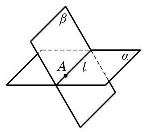

# 公理卡：公理 3 可具体表述为: 若两平面 $\alpha$ 及 $\beta$ 有一个公共点 $A$ ,则它们有唯一的公共直线 $l$ ,且公共点 $A$ 在 $l$ 上,如图 10-1-11 所示.

公理 3 可具体表述为: 若两平面 $\alpha$ 及 $\beta$ 有一个公共点 $A$ ,则它们有唯一的公共直线 $l$ ,且公共点 $A$ 在 $l$ 上,如图 10-1-11 所示.

