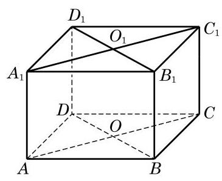

# 例题卡：例 3 如图 10-1-13,在长方体 ${ABCD} - {A}_{1}{B}_{1}{C}_{1}{D}_{1}$ 中,找出下列各对平面的交线:

例 3 如图 10-1-13,在长方体 ${ABCD} - {A}_{1}{B}_{1}{C}_{1}{D}_{1}$ 中,找出下列各对平面的交线:

(1)平面 ${ABCD}$ 与平面 $A{A}_{1}{B}_{1}B$ ；

(2)平面 ${A}_{1}{BD}$ 与平面 ${C}_{1}{BD}$ ；

(3)平面 ${AC}{C}_{1}{A}_{1}$ 与平面 ${BD}{D}_{1}{B}_{1}$ ；

(4)平面 ${ABCD}$ 与平面 $B{B}_{1}{D}_{1}$ .

解 (1) 因为 $A$ 及 $B$ 是平面 ${ABCD}$ 与平面 $A{A}_{1}{B}_{1}B$ 的公共点,所以这两个平面的交线是棱 ${AB}$ 所在的直线.

(2)因为 $B$ 及 $D$ 是平面 ${A}_{1}{BD}$ 与平面 ${C}_{1}{BD}$ 的公共点，所以这两个平面的交线是长方体底面对角线 ${BD}$ 所在的直线.

(3)如图 10-1-14，连接 ${AC}$ 与 ${BD}$ ，其交点为 $O$ ，连接 ${A}_{1}{C}_{1}$ 与 ${B}_{1}{D}_{1}$ ,其交点为 ${O}_{1}$ . 因为点 $A$ 及 $C$ 都在平面 ${AC}{C}_{1}{A}_{1}$ 上,所以直线 ${AC}$ 在平面 ${AC}{C}_{1}{A}_{1}$ 上. 又 $O \in  {AC}$ ,所以 $O$ 在平面 ${AC}{C}_{1}{A}_{1}$ 上. 同理可得, $O$ 在平面 ${BD}{D}_{1}{B}_{1}$ 上. 于是,点 $O$ 是平面 ${AC}{C}_{1}{A}_{1}$ 与平面 ${BD}{D}_{1}{B}_{1}$ 的公共点. 同理可知,点 ${O}_{1}$ 也是平面 ${AC}{C}_{1}{A}_{1}$ 与平面 ${BD}{D}_{1}{B}_{1}$ 的公共点. 这样,由公理 $3, O{O}_{1}$ 所在的直线是平面 ${AC}{C}_{1}{A}_{1}$ 与平面 ${BD}{D}_{1}{B}_{1}$ 的交线.

(4)因为 $B{B}_{1}//D{D}_{1}$ ，由公理 2 的推论 3 可知，这两条平行线 $B{B}_{1}$ 与 $D{D}_{1}$ 确定一个平面,从而 $D \in$ 平面 $B{B}_{1}{D}_{1}$ . 这样, $B$ 及 $D$ 是平面 ${ABCD}$ 与平面 $B{B}_{1}{D}_{1}$ 的公共点,从而直线 ${BD}$ 是这两个平面的交线.
