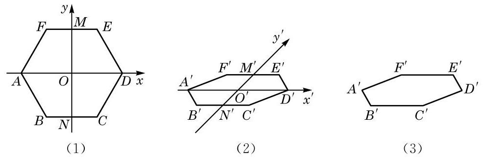

# 例题卡：例 4 用斜二测画法画一个水平放置的正六边形的直观图.

例 4 用斜二测画法画一个水平放置的正六边形的直观图.

画法 (1) 如图 10-1-15(1), 在已知正六边形 ABCDEF 中,取 ${AD}$ 所在直线为 $x$ 轴,取线段 ${AD}$ 的对称轴 ${MN}$ 为 $y$ 轴, 两轴相交于点 $O$ . 在图 10-1-15(2) 中,画相应的 ${x}^{\prime }$ 轴和 ${y}^{\prime }$ 轴, 两轴相交于点 ${O}^{\prime }$ ,且使 $\angle {x}^{\prime }{O}^{\prime }{y}^{\prime } = {45}^{ \circ  }$ .

(2)在图 10-1-15(2)中，以 ${O}^{\prime }$ 为中点，在 ${x}^{\prime }$ 轴上取 ${A}^{\prime }{D}^{\prime } = \; {AD}$ ,在 ${y}^{\prime }$ 轴上取 ${M}^{\prime }{N}^{\prime }$ ,使 ${M}^{\prime }{O}^{\prime } = {N}^{\prime }{O}^{\prime } = \frac{1}{2}{MO}$ . 以 ${M}^{\prime }$ 为中点画 ${E}^{\prime }{F}^{\prime }$ 平行于 ${x}^{\prime }$ 轴,并使 ${E}^{\prime }{F}^{\prime } = {EF}$ ; 类似地,再以 ${N}^{\prime }$ 为中点画 ${B}^{\prime }{C}^{\prime }$ 平行于 ${x}^{\prime }$ 轴,并使 ${B}^{\prime }{C}^{\prime } = {BC}$ .

(3)顺次连接 ${A}^{\prime }\text{ 、 }{B}^{\prime }\text{ 、 }{C}^{\prime }\text{ 、 }{D}^{\prime }\text{ 、 }{E}^{\prime }\text{ 、 }{F}^{\prime }\text{ 、 }{A}^{\prime }$ ，所得到的六边形 ${A}^{\prime }{B}^{\prime }{C}^{\prime }{D}^{\prime }{E}^{\prime }{F}^{\prime }$ 就是水平放置的正六边形 ${ABCDEF}$ 的直观图. 画好图后, 要擦去辅助线, 如图 10-1-15(3) 所示.

