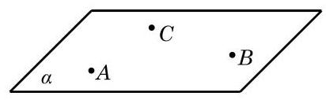

# 公理卡：公理 2 不在同一直线上的三点确定一个平面.

公理 2 不在同一直线上的三点确定一个平面.

这里，“确定一个平面”意指“(经过这三个点)有且只有一个平面”或“存在唯一的平面”，如图 10-1-8 所示. 公理 2 可以具体表述为: 若 $A\text{ 、 }B\text{ 、 }C$ 三点不在同一直线上,则存在唯一的平面 $\alpha$ ,使得 $A\text{ 、 }B\text{ 、 }C$ 三点均在此平面上.

根据公理 2 可以得到下面的三个推论:
