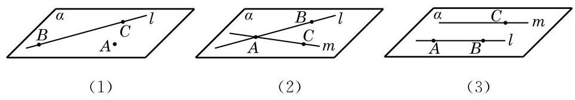

# 推论卡：推论 3 两条平行直线确定一个平面.

推论 3 两条平行直线确定一个平面.

图 10-1-9 给出了上述三个推论的直观表示. 这些推论也可以用符号语言来表述，如推论 1 可以表述为:若 $A \notin  l$ ，则存在唯一的平面 $\alpha$ ,使得 $A \in  \alpha , l \subset  \alpha$ .

公理是进一步推理的基础, 是不证自明的事实, 但公理的推论是需要证明的. 下面，我们仅给出推论 1 的证明. 推论 2 的证明可以仿照推论 1 进行, 推论 3 的证明要借助于公理 4 ，我们分别把它们放在本节和下一节的习题中留给同学们完成.

证明 设 $A$ 是直线 $l$ 外的一点,在直线 $l$ 上任取 $B$ 和 $C$ 两点 (图 10-1-9(1)). 由公理 2 可知, $A\text{ 、 }B$ 和 $C$ 三点能确定一个平面 $\alpha$ . 因为点 $B\text{ 、 }C \in  \alpha$ ,由公理 1 可知, $B\text{ 、 }C$ 所在的直线 $l \subset  \alpha$ ,从而平面 $\alpha$ 是由直线 $l$ 和点 $A$ 确定的平面.
