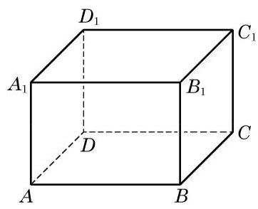

# 练习卡：练习 10.1(2)

(第 2 题)

1. 已知 $a\text{ 、 }b\text{ 、 }c$ 是空间的三条直线， $a//b$ ，且 $c$ 与 $a\text{ 、 }b$ 都相交. 求证: 直线 $a\text{ 、 }b\text{ 、 }c$ 在同一平面上.

2. 如图,在长方体 ${ABCD} - {A}_{1}{B}_{1}{C}_{1}{D}_{1}$ 中,画出 ${A}_{1}B$ 与 $A$ 、 ${B}_{1}\text{ 、 }C$ 所确定的平面的交点,并说明理由.

3. 如何用绳子检查桌椅的四个脚是否立于同一平面上? 给出方案并说明理由.
