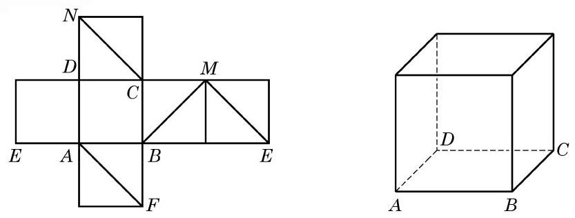

# 练习卡：练习 10.2(2)

1. 在教室里找出几对异面直线的例子.

2. 如果一条直线和两条异面直线中的一条平行, 那么它和另一条直线的位置关系是___.

3. 下页左图是一个正方体的平面展开图, 请在下页右图的正方体中画出对应的线段， 并指出正方体中的线段 ${CN}\text{ 、 }{AF}\text{ 、 }{BM}\text{ 、 }{ME}$ 中，哪些线段所在的直线与 ${DN}$ 所在的直线是异面直线.

(第 3 题)
