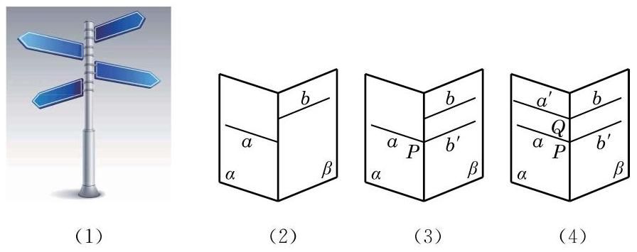
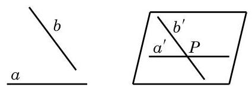

# 定理卡：3 两条异面直线所成的角

几何学除了要讨论几何图形之间的相互位置关系, 还要更精确地以定量的方法判断图形的位置与形状. 在平面几何中, 我们已分别通过夹角或距离来确定两条相交或平行的直线之间的相对位置. 空间中的两条相交或平行直线, 本质上可以看成某一平面上的两条相交或平行直线, 也可以用类似方法处理. 那么, 我们该如何确定两条异面直线的相对位置呢?

生活中经常可以看到图 10-2-13(1)所示的道路指示牌. 这些指示牌看上去形成了不同的角度, 指明了不同的方向. 我们把左边的实景图抽象为 10-2-13(2)中的示意图，用 $a$ 、 $b$ 等分别表示道路指示牌. 依据异面直线判定定理可知, 它们两两都是异面直线. 现在的问题是: 我们是否可以定义并确定这些异面直线之间的角度呢?

一个自然的想法是将两条异面直线转化为相交直线, 然后观察它们所成的角. 例如,在图 10-2-13(3) 中,在平面 $\beta$ 内,把直线 $b$ 平移到直线 $a$ 上的点 $P$ 处,记为 ${b}^{\prime }$ . 这样,直线 $a$ 与 ${b}^{\prime }$ 就在点 $P$ 处相交,它们之间可以用平面几何的方法来度量夹角的大小. 由于这样将直线平移的方法可以有很多, 需要考虑的是: 这样通过平移所形成的角的大小是唯一确定的吗? 例如, 在图 10-2-13(4)中，我们也可在平面 $\alpha$ 内，把直线 $a$ 平移到直线 $b$ 上的点 $Q$ 处,同样得到两条相交直线 ${a}^{\prime }$ 和 $b$ ,它们所成夹角的大小与 $a\text{ 、 }{b}^{\prime }$ 所成夹角的大小相等吗? 由等角定理的推论 2 可知,这两组相交直线所成的锐角 (或直角) 的确是相等的. 事实上,我们可以有下面更为一般的结论:

如图 10-2-14,设 $a\text{ 、 }b$ 是两条异面直线,在空间任取一点 $P$ ,过点 $P$ 分别作 $a\text{ 、 }b$ 的平行线 ${a}^{\prime }\text{ 、 }{b}^{\prime }$ ,那么相交直线 ${a}^{\prime }\text{ 、 }{b}^{\prime }$ 所成锐角(或直角)的大小是唯一确定的.

这样, 就可以给出下面的定义.

定义 两条异面直线平移到相交位置时所得到的锐角或直角, 称为这两条异面直线所成的角.

由上述定义知,两条异面直线所成角的范围是 ${0}^{ \circ  } < \theta  \leq  {90}^{ \circ  }$ , 在弧度制下是 $\theta  \in  \left( {0,\frac{\pi }{2}}\right\rbrack$ .

特别地,如果两条异面直线 $a\text{ 、 }b$ 所成的角是直角,就说这两条异面直线互相垂直,记作 $a \bot  b$ . 由上述定义容易推出: 如果 $a \bot  b, b//c$ ,那么 $a \bot  c$ .
