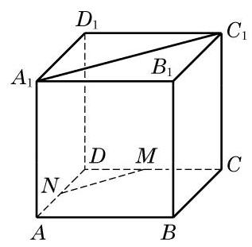
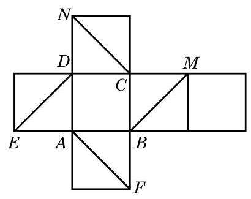
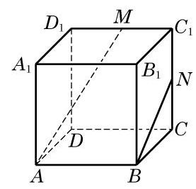
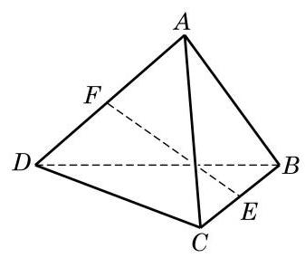
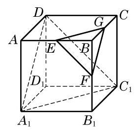
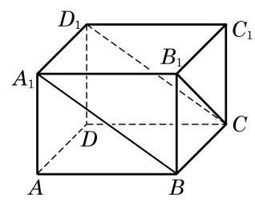
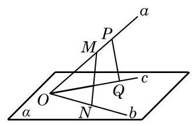
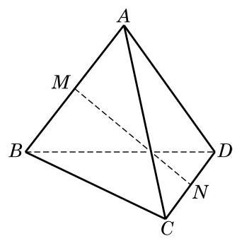
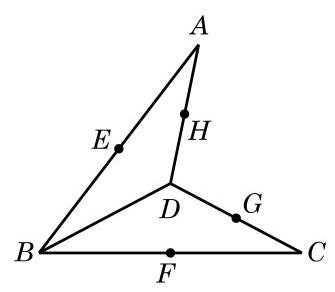

# 公理卡：习题 10.2

##### A 组

1. 证明公理 2 的推论 3.

2. 空间两条互相平行的直线指的是 ( )

A. 在空间没有公共点的两条直线;

B. 分别在两个平面上的两条直线;

C. 在两个不同的平面上且没有公共点的两条直线;

D. 在同一平面上且没有公共点的两条直线.

3. 如图,在正方体 ${ABCD} - {A}_{1}{B}_{1}{C}_{1}{D}_{1}$ 中, $M\text{ 、 }N$ 分别为 ${CD}\text{ 、 }{AD}$ 的中点. 求证: ${MN}//{A}_{1}{C}_{1}$ .

4. 如图是一个正方体的平面展开图, 在这个正方体中, 下列说法中正确的序号是___.

① 直线 ${AF}$ 与直线 ${DE}$ 相交;

② 直线 ${CN}$ 与直线 ${DE}$ 平行;

③ 直线 ${BM}$ 与直线 ${DE}$ 是异面直线；

④ 直线 ${CN}$ 与直线 ${BM}$ 成 ${60}^{ \circ  }$ 角.

(第 3 题)

(第 4 题)

(第 5 题)

5. 如图,在正方体 ${ABCD} - {A}_{1}{B}_{1}{C}_{1}{D}_{1}$ 中, $M\text{ 、 }N$ 分别是棱 ${C}_{1}{D}_{1}\text{ 、 }{C}_{1}C$ 的中点. 判断下列结论是否成立, 并说明理由:

(1)直线 ${AM}$ 与 $C{C}_{1}$ 是相交直线;

(第 7 题)

(2)直线 ${AM}$ 与 ${BN}$ 是平行直线；

(3)直线 ${AM}$ 与 $D{D}_{1}$ 是异面直线.

6. 已知 $A\text{ 、 }B\text{ 、 }C\text{ 、 }D$ 是空间四个点,且直线 ${AB}$ 与 ${CD}$ 是两条异面直线. 求证: 直线 ${AC}$ 与 ${BD}$ 也是异面直线.

7. 如图,在四面体 ${ABCD}$ 中, ${AB} = {CD},{AB} \bot  {CD}, E\text{ 、 }F$ 分别为 ${BC}\text{ 、 }{AD}$ 的中点. 求直线 ${EF}$ 和 ${AB}$ 所成角的大小.

##### B 组

1. 如果两个三角形不在同一平面上，它们的边两两对应平行，那么这两个三角形( )

A. 全等; B. 相似;

C. 相似但不全等; D. 不相似.

2. 如图,在正方体 ${ABCD} - {A}_{1}{B}_{1}{C}_{1}{D}_{1}$ 中, $E\text{ 、 }F\text{ 、 }G$ 分别是 ${AB}\text{ 、 }B{B}_{1}\text{ 、 }{BC}$ 的中点. 求证: $\bigtriangleup {EFG} \backsim  \bigtriangleup {C}_{1}D{A}_{1}$ .

(第 2 题)

(第 3 题)

3. 如图，在长方体 ${ABCD} - {A}_{1}{B}_{1}{C}_{1}{D}_{1}$ 中，判断下列直线的位置关系:

(1)直线 ${A}_{1}B$ 与直线 ${D}_{1}C$ 的位置关系是___；

(2)直线 ${A}_{1}B$ 与直线 ${B}_{1}C$ 的位置关系是___；

(3)直线 ${D}_{1}D$ 与直线 ${D}_{1}C$ 的位置关系是___.

(4)直线 ${AB}$ 与直线 ${B}_{1}C$ 的位置关系是___.

4. 如图,已知不在同一平面上的三条直线 $a\text{ 、 }b\text{ 、 }c$ 相交于点 $O, M\text{ 、 }P$ 是直线 $a$ 上的两点, $N\text{ 、 }Q$ 分别是直线 $b\text{ 、 }c$ 上与点 $O$ 不重合的点. 求证: ${MN}$ 和 ${PQ}$ 是异面直线.

5. 如图,在四面体 ${ABCD}$ 中, ${AC} = 8,{BD} = 6, M\text{ 、 }N$ 分别为 ${AB}\text{ 、 }{CD}$ 的中点,并且异面直线 ${AC}$ 与 ${BD}$ 所成的角为 ${90}^{ \circ  }$ . 求 ${MN}$ 的长.

(第 4 题)

(第 5 题)

(第 6 题)

6. 如图,在空间四边形 ${ABCD}$ 中, $E\text{ 、 }F\text{ 、 }G\text{ 、 }H$ 分别是边 ${AB}\text{ 、 }{BC}\text{ 、 }{CD}\text{ 、 }{DA}$ 的中点. 当对角线 ${AC}$ 和 ${BD}$ 满足什么条件时, ${EFGH}$ 分别是矩形、菱形、正方形?
