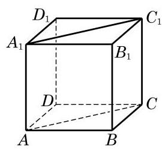

# 公理卡：公理 4 表明, 直线的平行关系在空间同样具有传递性.

公理 4 表明, 直线的平行关系在空间同样具有传递性.

有了公理 4 ，我们就可以解释前面的两种实际情景. 例如， 在图 10-2-1 的情景中, 因为书的每一页都是矩形, 所以每一页的外边界所在的直线都平行于书脊所在的直线, 从而由平行关系的传递性知, 每一页的外边界所在的直线都是相互平行的.

---

围栏的情景请同学们自己依据公理 4 给出合理的解释.

---

