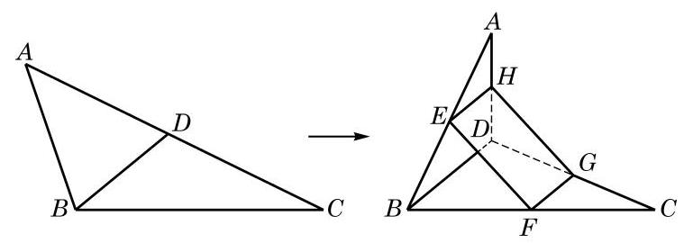

# 例题卡：例 2 如图 10-2-5, ${ABC}$ 是一张三角形的纸片, $D$ 是边 ${AC}$ 上的一点. 我们将此三角形纸片沿 ${BD}$ 折成一个空间四边形 ${ABCD}$ . 在这个空间四边形 ${ABCD}$ 中, $E\text{ 、 }F\text{ 、 }G\text{ 、 }H$ 分别为边 ${AB}\text{ 、 }{BC}\text{ 、 }{CD}\text{ 、 }{DA}$ 的中点.

例 2 如图 10-2-5, ${ABC}$ 是一张三角形的纸片, $D$ 是边 ${AC}$ 上的一点. 我们将此三角形纸片沿 ${BD}$ 折成一个空间四边形 ${ABCD}$ . 在这个空间四边形 ${ABCD}$ 中, $E\text{ 、 }F\text{ 、 }G\text{ 、 }H$ 分别为边 ${AB}\text{ 、 }{BC}\text{ 、 }{CD}\text{ 、 }{DA}$ 的中点.

求证: ${EFGH}$ 是平行四边形.

---

(1)将空间四边形 ABCD 还原到原来的位置, 那么所得到的四边形 EFGH 还是平行四边形吗?

(2)若 $E$ 、 $F$ 、 $G$ 、 $H$ 不是所在边的中点, ${EFGH}$ 是否仍可能是平行四边形?

---

证明 因为 ${EH}$ 是 $\bigtriangleup {ABD}$ 的一条中位线,所以 ${EH}//{BD}$ , 且 ${EH} = \frac{1}{2}{BD}$ . 同理, ${FG}$ 是 $\bigtriangleup {CBD}$ 的一条中位线,有 ${FG}// \; {BD}$ ,且 ${FG} = \frac{1}{2}{BD}$ . 由公理 4,知 ${EH}//{FG}$ ,且 ${EH} = {FG}$ ,从而 ${EFGH}$ 是平行四边形.
