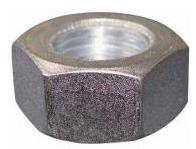
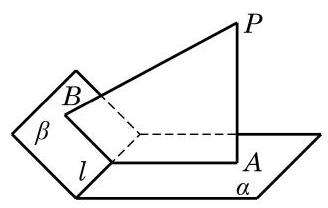

# 练习卡：练习 10.3(3)

1. 加工六角螺母, 只要螺母的六个侧面都是矩形, 那么六条侧棱一定都垂直于螺母的上下两面. 请说明理由.

(第 1 题)

(第 3 题)

2. 设 ${AB}$ 和 ${CD}$ 都是平面 $\alpha$ 的垂线,其垂足分别为 $B\text{ 、 }D$ . 已知 ${AB} = 2\mathrm{\;{cm}}$ , ${CD} = 5\mathrm{\;{cm}}$ ， ${BD} = 4\mathrm{\;{cm}}$ . 求线段 ${AC}$ 的长.

3. 如图,已知 ${PA}$ 垂直于平面 $\alpha ,{PB}$ 垂直于平面 $\beta , A\text{ 、 }B$ 为相应的垂足,且 $l$ 为平面 $\alpha$ 与平面 $\beta$ 的交线. 求证: $l \bot$ 平面 ${PAB}$ .
