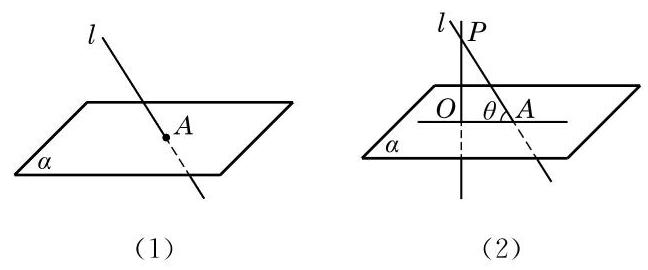

# 概念卡：3 直线与平面所成的角

不在平面上的一条直线与这个平面的位置关系, 除了平行和垂直, 还有一种更一般的位置关系, 即此直线与平面虽然相交, 但不垂直,称之为斜交. 如图 10-3-15(1),此时直线 $l$ 称为平面 $\alpha$ 的斜线,直线 $l$ 与平面 $\alpha$ 的交点 $A$ 称为斜足.

如何度量平面的斜线与平面的倾斜程度呢? 我们在直线 $l$ 上任取一个不同于斜足的点 $P$ ,如图 10-3-15(2) 所示. 过点 $P$ 作平面 $\alpha$ 的垂线,垂足记为 $O$ . 连接 ${OA}$ ,直线 ${OA}$ 叫做斜线 $l$ 在平面 $\alpha$ 上的投影 (也称射影). 线段 ${PA}$ 的投影是线段 ${OA}$ . 容易证明, 平面的一条斜线在平面上的投影与点 $P$ 的选择无关,是唯一确定的,从而可以用斜线与它的投影所成的锐角 $\theta$ 来定义此斜线与平面所成的角.

定义 平面的一条斜线和它在平面上的投影所成的锐角, 叫做这条直线和这个平面所成的角.

---

在直线与平面垂直的情况下，其投影就是相应的垂足.

---

另外, 我们约定, 如果一条直线垂直于平面, 我们说它们所成的角是直角; 如果一条直线和平面平行或在该平面上, 就说二者所成的角是 ${0}^{ \circ  }$ 的角.
