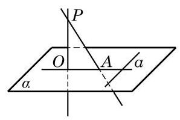

# 定理卡：4 三垂线定理

关于平面的斜线及其在平面上的投影, 我们有下面的定理.

三垂线定理 平面上的一条直线和这个平面的一条斜线垂直的充要条件是它和这条斜线在平面上的投影垂直.

---

在讨论空间直线的垂直关系时，三垂线定理是一个常用的工具.

---

已知: 如图 10-3-18, $P$ 是平面 $\alpha$ 外一点, ${PA}$ 是平面 $\alpha$ 的斜线,交 $\alpha$ 于点 $A$ . 过点 $P$ 作平面 $\alpha$ 的垂线 ${PO}$ ,垂足是 $O$ ,直线 ${OA}$ 是 ${PA}$ 在平面 $\alpha$ 上的投影.

求证: 对平面 $\alpha$ 上的任一直线 $a, a \bot  {OA}$ 是 $a \bot  {PA}$ 的充要条件.

证明 先证充分性,即证明从 $a \bot  {OA}$ 可以推出 $a \bot  {PA}$ .

因为 ${PO} \bot$ 平面 $\alpha$ ,而 $a \subset  \alpha$ ,所以 ${PO} \bot  a$ . 这样,连同假设条件,直线 $a$ 垂直于两条相交直线 ${PO}$ 与 ${OA}$ ,从而它垂直于这两条相交直线所确定的平面 ${PAO}$ . 而直线 ${PA} \subset$ 平面 ${PAO}$ ,于是 $a \bot  {PA}$ .

再证必要性,即反过来从 $a \bot  {PA}$ 可以推出 $a \bot  {OA}$ .

同上,我们有 ${PO} \bot  a$ ,这个条件连同假设条件 $a \bot  {PA}$ ,推出直线 $a$ 垂直于两条相交直线 ${PO}$ 与 ${PA}$ 所确定的平面 ${PAO}$ . 而直线 ${OA} \subset$ 平面 ${PAO}$ ,于是 $a \bot  {OA}$ .
