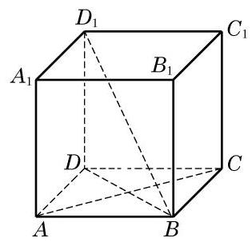

# 例题卡：例 8 如图 10-3-19,已知正方体 ${ABCD} - {A}_{1}{B}_{1}{C}_{1}{D}_{1}$ .

例 8 如图 10-3-19,已知正方体 ${ABCD} - {A}_{1}{B}_{1}{C}_{1}{D}_{1}$ .

求证: ${AC} \bot  B{D}_{1}$ .

---

在此正方体中, 还有哪些面的对角线与 $B{D}_{1}$ 垂直? 为什么? 由此能得到 $B{D}_{1}$ 垂直于哪些截面?

---

证明 直线 $B{D}_{1}$ 在平面 ${ABCD}$ 上的投影是 ${BD}$ ,显然有 ${BD} \; \bot  {AC}$ .

由三垂线定理,就得 ${AC} \bot  B{D}_{1}$ .
