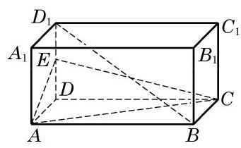
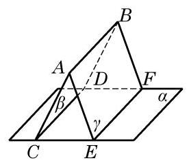
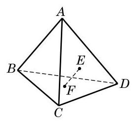
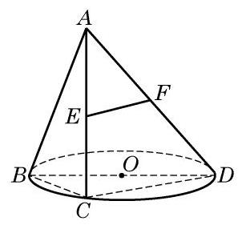
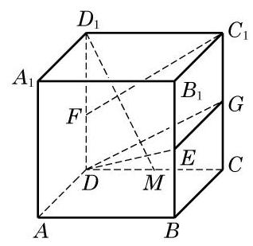
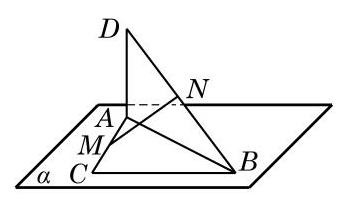

# 概念卡：习题 10.3

##### A 组

1. 如图,在长方体 ${ABCD} - {A}_{1}{B}_{1}{C}_{1}{D}_{1}$ 中, $E$ 是棱 $D{D}_{1}$ 的中点,试判断 $B{D}_{1}$ 与平面 ${AEC}$ 的位置关系,并说明理由.

(第 1 题)

(第 3 题)

2. 在长方体 ${ABCD} - {A}_{1}{B}_{1}{C}_{1}{D}_{1}$ 中, $M\text{ 、 }N$ 分别为矩形 ${A}_{1}{AD}{D}_{1}$ 和 ${D}_{1}{C}_{1}{CD}$ 的中心. 求证: ${MN}//$ 平面 ${ABCD}$ .

3. 如图， $\alpha  \cap  \beta  = {CD}$ ， $\alpha  \cap  \gamma  = {EF}$ ， $\beta  \cap  \gamma  = {AB}$ ， ${AB}//\alpha$ . 求证: ${CD}//{EF}$ .

4. 已知 $E\text{ 、 }F$ 分别是空间四边形 ${ABCD}$ 的边 ${BC}\text{ 、 }{AD}$ 的中点,过直线 ${EF}$ 且平行于 ${AB}$ 的平面与 ${AC}$ 交于点 $G$ . 求证: $G$ 是 ${AC}$ 的中点.

5. 证明: 如果直线 $l//$ 平面 $\alpha$ ,那么 $l$ 上任意两点到平面 $\alpha$ 的距离都相等.

6. 已知平面 $\alpha$ 与平面 $\beta$ 相交于直线 ${AB}$ ,直线 ${PC}$ 垂直于平面 $\alpha$ ,直线 ${PD}$ 垂直于平面 $\beta$ ,其垂足分别为 $C\text{ 、 }D$ . 求证: ${AB} \bot  {CD}$ .

7. 由平面 $\alpha$ 外一点 $A$ 向 $\alpha$ 分别引斜线段 ${AB}\text{ 、 }{AC}$ ，已知这两条斜线段和平面 $\alpha$ 所成角的大小之比为 $2 : 1$ ,而它们的长度之比为 $2 : 3$ . 分别求斜线段 ${AB}\text{ 、 }{AC}$ 和平面 $\alpha$ 所成角的大小.

8. 从平面外一点 $D$ 向该平面引垂线段 ${DA}$ 及斜线段 ${DB}\text{ 、 }{DC}$ ，已知 ${DA}$ 的长为 $a$ ， $\angle {BDA} = \angle {CDA} = {60}^{ \circ  },\angle {BDC} = {90}^{ \circ  }$ . 求 ${BC}$ 的长.

9. 证明: 两条平行直线和同一个平面所成的角相等.

10. 在正方体 ${ABCD} - {A}_{1}{B}_{1}{C}_{1}{D}_{1}$ 中,求证: ${D}_{1}B \bot$ 平面 $A{B}_{1}C$ .

##### B 组

(第 1 题)

1. 如图,在四面体 ${ABCD}$ 中, $E\text{ 、 }F$ 分别是 $\bigtriangleup {ACD}\text{ 、 }\bigtriangleup {BCD}$ 的重心. 该四面体中,哪些面与 ${EF}$ 平行? 请说明理由.

2. 如图,已知 ${BD}$ 是 $\odot  O$ 的直径,点 $C$ 是 $\odot  O$ 上的动点. 设过动点 $C$ 的直线 ${AC}$ 垂直于 $\odot  O$ 所在的平面,且 $E\text{ 、 }F$ 分别是边 ${AC}\text{ 、 }{AD}$ 的中点. 求证: ${EF} \bot$ 平面 ${ABC}$ .

(第 2 题)

(第 3 题)

3. 如图,在棱长为 1 的正方体 ${ABCD} - {A}_{1}{B}_{1}{C}_{1}{D}_{1}$ 中, $E\text{ 、 }F$ 及 $G$ 分别为棱 $B{B}_{1}$ 、 $D{D}_{1}$ 和 $C{C}_{1}$ 的中点.

(1)求证: ${C}_{1}F//$ 平面 ${DEG}$ ；

(2)试在棱 ${CD}$ 上取一点 $M$ ，使 ${D}_{1}M \bot$ 平面 ${DEG}$ .

4. 经过一个角的顶点引这个角所在平面的斜线. 如果此斜线和这个角两边的夹角相等, 求证: 该斜线在平面上的投影是这个角的角平分线所在的直线.

(第 5 题)

5. 如图，在 $\bigtriangleup  {ABC}$ 中， $\angle {ACB} = {90}^{ \circ  }$ ，且 ${DA}$ 垂直于 $\bigtriangleup  {ABC}$ 所在的平面 $\alpha , M\text{ 、 }N$ 分别是边 ${AC}\text{ 、 }{DB}$ 的中点.

求证: ${MN} \bot  {AC}$ .
