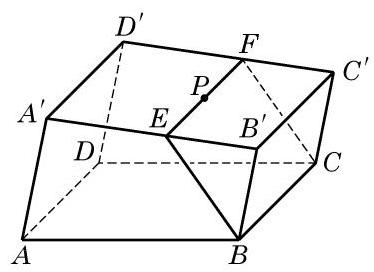

# 例题卡：例 3 在如图 10-3-5 所示的一块木料中,棱 ${BC}$ 平行于平面 ${A}^{\prime }{B}^{\prime }{C}^{\prime }{D}^{\prime }$ .

例 3 在如图 10-3-5 所示的一块木料中,棱 ${BC}$ 平行于平面 ${A}^{\prime }{B}^{\prime }{C}^{\prime }{D}^{\prime }$ .

(1)要经过平面 ${A}^{\prime }{B}^{\prime }{C}^{\prime }{D}^{\prime }$ 内的一点 $P$ 和棱 ${BC}$ 将木料锯开, 应怎样画线?

(2)所画的线与平面 ${ABCD}$ 是什么位置关系？

解(1)因为 ${BC}$ 平行于平面 ${A}^{\prime }{B}^{\prime }{C}^{\prime }{D}^{\prime }$ ,平面 ${BC}{C}^{\prime }{B}^{\prime }$ 经过 ${BC}$ 并与平面 ${A}^{\prime }{B}^{\prime }{C}^{\prime }{D}^{\prime }$ 交于 ${B}^{\prime }{C}^{\prime }$ ,由上述定理,得 ${BC}//{B}^{\prime }{C}^{\prime }$ .

在平面 ${A}^{\prime }{B}^{\prime }{C}^{\prime }{D}^{\prime }$ 上,过点 $P$ 作直线 ${EF}$ ,使 ${EF}//{B}^{\prime }{C}^{\prime }$ , ${EF}$ 分别交棱 ${A}^{\prime }{B}^{\prime }\text{ 、 }{C}^{\prime }{D}^{\prime }$ 于点 $E\text{ 、 }F$ . 连接 ${BE}\text{ 、 }{CF}$ ,则 ${EF}$ 、 ${BE}$ 及 ${CF}$ 就是应画的线,如图 10-3-6 所示.

(2)所画的线中， ${BE}\text{ 、 }{CF}$ 显然都与平面 ${ABCD}$ 相交. 又因为 ${EF}//{B}^{\prime }{C}^{\prime }$ ，从而 ${EF}//{BC}$ . 因此，由前述的判定定理，有 ${EF}//$ 平面 ${ABCD}$ .
