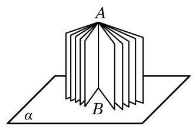
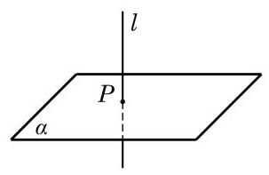
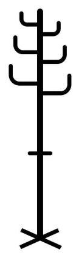
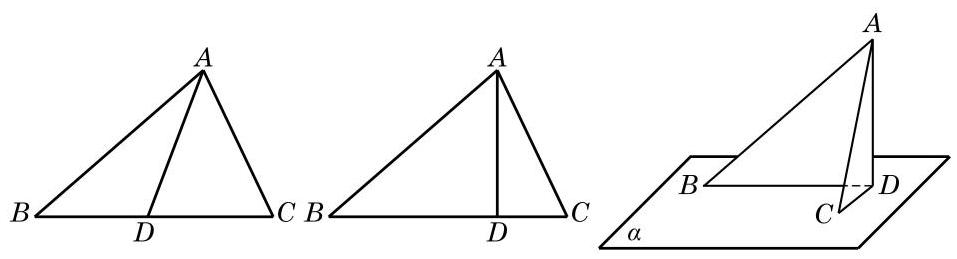

# 定理卡：2 直线与平面垂直

如图 10-3-7,将书打开直立在桌面上,观察书的书脊 ${AB}$ 和各页与桌面的交线的位置关系,可以发现: 书脊 ${AB}$ 所在的直线,和每一页与桌面的交线都是垂直的. 这时,我们说书脊 ${AB}$ 所在的直线垂直于桌面所在的平面.

日常生活中, 旗杆与地面、桥柱与水面等, 都给我们以一条直线和一个平面垂直的形象.

定义 如果一条直线与平面上的任意一条直线都垂直, 就说这条直线与这个平面互相垂直.

如果直线 $l$ 与平面 $\alpha$ 垂直,我们记作 $l\bot \alpha$ . 这时,直线 $l$ 叫做平面 $\alpha$ 的垂线 (或者法线), $l$ 与 $\alpha$ 的交点叫做垂足. 画示意图时,通常使直线 $l$ 与表示平面 $\alpha$ 的平行四边形的一边垂直 (图 10-3-8).

显然, 用上述定义来直接判断线面垂直关系是很困难的, 能否像线面平行的情形一样找到一个简便的判定定理呢?

先做一个实验: 请同学们准备一块三角形纸片 ${ABC}$ ,过 $\bigtriangleup {ABC}$ 的顶点 $A$ 翻折纸片,得到折痕 ${AD}$ . 将翻折后的纸片竖起放置在桌面上,并使得边 ${DB}\text{ 、 }{DC}$ 均在桌面上.

(1)折痕 ${AD}$ 与桌面垂直吗?

(2)如何翻折才能使折痕 ${AD}$ 与桌面所在平面 $\alpha$ 垂直？

通过实验会发现,当且仅当折痕 ${AD}$ 是边 ${BC}$ 上的高时, ${AD}$ 所在直线与桌面所在平面才垂直(图 10-3-9).

生活中, 我们可以发现许多竖杆的底座是十字形的(图 10-3-10)，只要竖杆与底座的两条边垂直，就可以保证竖杆垂直于地面。

由上面的实验和实际经验, 我们可以发现下面的事实.

**直线与平面垂直的判定定理** 如果一条直线与一个平面上的两条相交直线都垂直, 那么此直线与该平面垂直.

---

有兴趣的同学可以自己试一试证明此判定定理.

---

有了这个判定定理, 我们就可以解释上面的实验与实际经验. 例如,在图 10-3-9 中,由折痕 ${AD} \bot  {BC}$ ,而翻折保持这种垂直关系不变,从而 ${AD} \bot  {CD},{AD} \bot  {BD}$ . 因此,由上述判定定理就知道,折痕 ${AD}$ 与桌面所在的平面 $\alpha$ 垂直.
