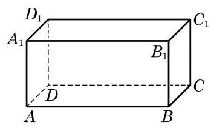
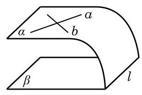
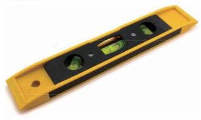

# 定理卡：1 平面与平面平行

我们希望通过直线间或线面间的平行关系来判断平面间的平行关系. 为此, 先思考下面的问题:

(1)如果平面 $\alpha$ 平行于平面 $\beta$ ,那么这两个平面上的一切直线都相互平行吗?

(2)如果平面 $\alpha$ 上有一条直线与平面 $\beta$ 平行,那么能保证这两个平面平行吗?

(3)如果平面 $\alpha$ 上有两条相交直线与平面 $\beta$ 平行，那么能保证这两个平面平行吗?

问题(1)的回答是否定的. 事实上，长方体的上、下两个底面平行,但这两个底面上的直线间有不同的位置关系,如 ${AB}$ 平行于 ${A}_{1}{B}_{1}$ ,而 ${AB}$ 与 ${A}_{1}{D}_{1}$ 异面且垂直,如图 10-4-1 所示.

问题(2)的回答也是否定的. 例如，当三角板的一条边所在的直线与桌面所在的平面平行时, 不能保证三角板所在平面与桌面所在平面保持平行, 因为这个三角板还可以绕这条边转动.

至于问题(3)，其答案应是肯定的，因为两条相交的直线完全确定了这个平面. 我们可以用反证法来严格地加以证明: 如图 10-4-2,假设 $\alpha$ 不平行于 $\beta$ ,那么 $\alpha$ 与 $\beta$ 相交于直线 $l$ . 由直线与平面平行的性质定理知,直线 $a$ 及 $b$ 均平行于 $l$ ,从而 $a//b$ . 这与已知 $a\text{ 、 }b$ 是相交直线矛盾. 故假设不成立,即 $\alpha //\beta$ .

由此, 我们就得到了下面的定理.

两个平面平行的判定定理 如果一个平面上的两条相交直线与另一个平面平行, 那么这两个平面平行.

上述定理可以帮助我们方便地判断两个平面是否平行. 例如, 在测量时, 为判断一个平面与水平面是否平行, 可将水平仪 (图 10-4-3)置放在这个平面上, 并变换方向测试两次, 如果水平仪的水泡两次都居中, 就可以断定这个平面和水平面是平行的.

