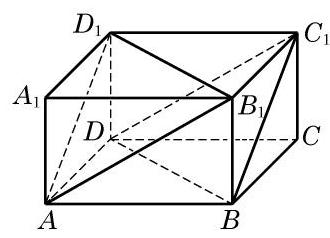
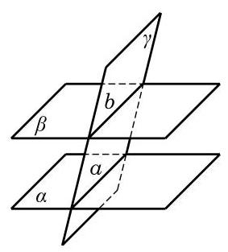

# 例题卡：例 1 证明: 长方体 ${ABCD} - {A}_{1}{B}_{1}{C}_{1}{D}_{1}$ 的平面 $A{B}_{1}{D}_{1}$ 平行于平面 ${C}_{1}{DB}$ .

例 1 证明: 长方体 ${ABCD} - {A}_{1}{B}_{1}{C}_{1}{D}_{1}$ 的平面 $A{B}_{1}{D}_{1}$ 平行于平面 ${C}_{1}{DB}$ .

证明 如图 10-4-4,不在平面 $A{B}_{1}{D}_{1}$ 上的直线 $B{C}_{1}$ 平行于平面 $A{B}_{1}{D}_{1}$ 上的直线 $A{D}_{1}$ ,所以直线 $B{C}_{1}//$ 平面 $A{B}_{1}{D}_{1}$ . 同理,不在平面 $A{B}_{1}{D}_{1}$ 上的直线 ${C}_{1}D//$ 平面 $A{B}_{1}{D}_{1}$ . 因为 $B{C}_{1}$ 与 ${C}_{1}D$ 是相交直线,所以它们确定的平面 ${C}_{1}{BD}//$ 平面 $A{B}_{1}{D}_{1}$ .

由上面的讨论可知, 如果两个平面平行, 一个平面上的直线与另一个平面上的直线可能是平行的, 也有可能是异面的. 那么, 如何在两个平行平面上找到相互平行的直线呢? 为此, 我们来考察两个平行平面与第三个平面相交的情况, 得出下面的定理.

两个平面平行的性质定理 如果两个平行平面同时和第三个平面相交,那么它们的交线平行.

证明 如图 10-4-5,设平面 $\gamma$ 与平行平面 $\alpha \text{ 、 }\beta$ 相交,有两条交线 $a\text{ 、 }b$ . 因为 $\alpha //\beta$ ,所以 $\alpha \text{ 、 }\beta$ 没有公共点,从而交线 $a$ 、 $b$ 也没有公共点. 又因为 $a\text{ 、 }b$ 都在平面 $\gamma$ 上,所以 $a//b$ .
