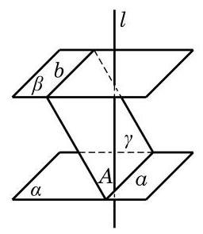
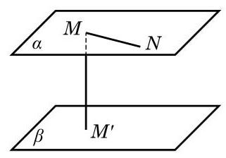

# 例题卡：例 2 若一条直线 $l$ 垂直于两个平行平面 $\alpha \text{ 、 }\beta$ 中的一个平面 $\alpha$ ,则它必垂直于另一个平面 $\beta$ .

例 2 若一条直线 $l$ 垂直于两个平行平面 $\alpha \text{ 、 }\beta$ 中的一个平面 $\alpha$ ,则它必垂直于另一个平面 $\beta$ .

证明 如图 10-4-6,记 $A$ 为直线 $l$ 与平面 $\alpha$ 的交点 (垂足). 设 $b$ 是平面 $\beta$ 内任意给定的一条直线,而平面 $\gamma$ 是经过点 $A$ 与直线 $b$ 的平面. 设 $\gamma  \cap  \alpha  = a$ .

因为平面 $\alpha //$ 平面 $\beta$ ,平面 $\gamma$ 与平面 $\alpha$ 和平面 $\beta$ 的交线分别为直线 $a$ 和直线 $b$ ,所以 $a//b$ . 又因为直线 $l$ 垂直于平面 $\alpha$ ,所以 $l \bot  b$ . 由直线与平面垂直的定义,知 $l \bot  \beta$ .

在 10.3 节我们已经定义过点到平面的距离以及一条直线到与它平行的平面的距离, 现在可以进一步定义两个平行平面之间的距离. 为此,先注意到,如果平面 $\alpha //$ 平面 $\beta$ ,在平面 $\alpha$ 上任取两点 $M$ 与 $N$ ,那么平面 $\alpha$ 上的直线 ${MN}$ 与平面 $\beta$ 没有交点, 所以 ${MN}//$ 平面 $\beta$ (图 10-4-7). 由此可见,点 $M$ 与点 $N$ 到平面 $\beta$ 的距离是相等的. 这说明了平面 $\alpha$ 上的任意点到平面 $\beta$ 的距离都相等. 这个距离也等于平面 $\beta$ 上任意一点到平面 $\alpha$ 的距离: 如图10-4-7,过平面 $\alpha$ 上的点 $M$ 作平面 $\beta$ 的垂线,交平面 $\beta$ 于 ${M}^{\prime }$ , 则 $M{M}^{\prime }$ 既是点 $M$ 到平面 $\beta$ 的距离,也是点 ${M}^{\prime }$ 到平面 $\alpha$ 的距离.

这样, 我们可以把两个平行平面之间的距离定义为其中一个平面上的任意一点到另外一个平面的距离. 上一段的论述表明这样的定义是没有歧义的.
