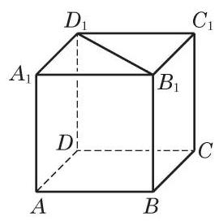

# 练习卡：练习 10.4(1)

1. 判断下列命题的真假, 并说明理由:

(1)若一个平面内的两条直线均平行于另一个平面，则这两个平面平行；

(2)若一个平面内两条不平行的直线都平行于另一个平面，则这两个平面平行；

(3)若两个平面平行，则其中一个平面中的任何直线都平行于另一个平面；

(4)平行于同一个平面的两个平面平行；

(5)若一个平面内的任何一条直线都平行于另一个平面, 则这两个平面平行.

(第 2 题)

2. 如图,已知正方体 ${ABCD} - {A}_{1}{B}_{1}{C}_{1}{D}_{1}$ 的棱长为 $a$ ,求:

(1)点 ${A}_{1}$ 到直线 ${BC}$ 的距离；

(2)点 $A$ 到平面 ${B}_{1}{BC}{C}_{1}$ 的距离；

(3) ${B}_{1}{D}_{1}$ 到平面 ${ABCD}$ 的距离；

(4)平面 ${B}_{1}{BC}{C}_{1}$ 到平面 ${A}_{1}{AD}{D}_{1}$ 的距离.

3. 证明:夹在两个平行平面间的平行线段相等.
