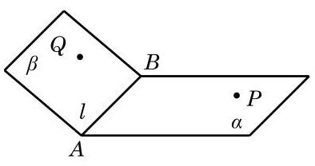
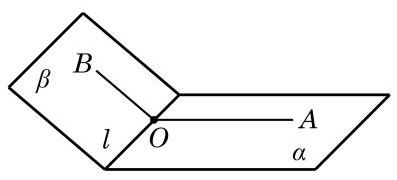
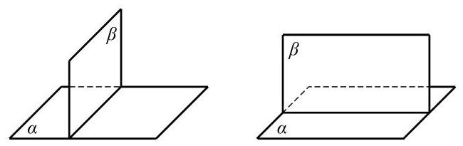
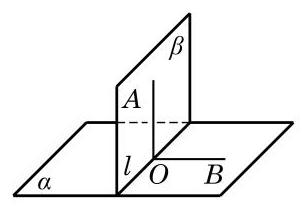
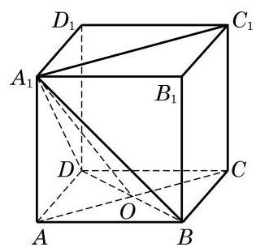

# 定理卡：2 二面角

在开门时，有时开得大些，有时开得小些，这里的“大”或 “小”，可用门所在平面和门框所在平面之间的夹角来度量. 现在, 我们来定义两个平面之间的夹角.

如图 10-4-8, 从一条直线出发的两个半平面所组成的图形叫做二面角(dihedral angle). 这条直线叫做二面角的棱, 这两个半平面叫做二面角的面. 棱为 ${AB}$ ,两个面为 $\alpha \text{ 、 }\beta$ 的二面角,记作二面角 $\alpha  - {AB} - \beta$ ；也可以在 $\alpha \text{ 、 }\beta$ 上(棱以外的半平面部分)分别取点 $P\text{ 、 }Q$ ,将这个二面角记作二面角 $P - {AB} - Q$ . 如果棱记作 $l$ ,那么这个二面角也可以记作二面角 $\alpha  - l - \beta$ 或 $P - l - Q$ .

下面我们要讨论的问题是应该如何刻画一个二面角的大小.

如图 10-4-9,若在二面角 $\alpha  - l - \beta$ 的棱 $l$ 上任取一点 $O$ ,且过 $O$ 分别在面 $\alpha$ 、 $\beta$ 上作棱 $l$ 的垂线 ${OA}$ 和 ${OB}$ ,容易证明射线 ${OA}$ 和 ${OB}$ 构成的角 $\angle {AOB}$ 的大小与点 $O$ 的取法无关. 因此,我们可以用 $\angle {AOB}$ 来表示二面角 $\alpha  - l - \beta$ 的大小,并称其为二面角 $\alpha  - l - \beta$ 的平面角. 二面角的取值范围是 $\left\lbrack  {0,\pi }\right\rbrack$ . 当二面角 $\alpha  - l - \beta$ 的大小等于直角时, 我们称这个二面角为直二面角.

当两个平面相交所成的二面角是直二面角时, 我们就说这两个平面互相垂直.

两个互相垂直的平面, 一般画成图 10-4-10 的样子: 将直立平面的竖边画成和水平平面的横边垂直. 平面 $\alpha$ 与平面 $\beta$ 垂直， 记作 $\alpha  \bot  \beta$ .

用下面的定理判定两个平面垂直比直接用定义要方便一些.

平面与平面垂直的判定定理 如果一个平面经过另一个平面的一条垂线,那么这两个平面垂直.

证明 设平面 $\beta$ 过另一平面 $\alpha$ 的垂线 ${OA}$ ,点 $O$ 在平面 $\alpha$ 上, 则平面 $\beta$ 与平面 $\alpha$ 交于过点 $O$ 的直线 $l$ ，且 ${OA} \bot  l$ . 如图 10-4-11， 在平面 $\alpha$ 上过点 $O$ 作 ${OB} \bot  l$ ，则 $\angle {AOB}$ 是二面角 $\alpha  - l - \beta$ 的平面角. 由 ${OA} \bot  \alpha$ 与 ${OB} \subset  \alpha$ ,推出 ${OA} \bot  {OB}$ ,即 $\angle {AOB}$ 是直角,从而二面角 $\alpha  - l - \beta$ 是直二面角,所以 $\beta  \bot  \alpha$ .

上面的定理的条件与结论实际上是一对充要条件, 也就是说, 我们还可以证明: 如果两个平面垂直, 那么其中一个平面过另一个平面的一条垂线. 下面的定理是这个结论的推广.

平面与平面垂直的性质定理 如果两个平面垂直, 那么其中一个平面上垂直于两平面交线的直线与另一个平面垂直.

证明 仍参看图 10-4-11,平面 $\alpha  \bot$ 平面 $\beta$ ,它们的交线是 $l$ . 直线 ${OA} \subset  \beta$ ,且 ${OA} \bot  l$ ,垂足是 $O$ . 过点 $O$ 在平面 $\alpha$ 上作 ${OB} \bot  l$ , 则 $\angle {AOB}$ 是二面角 $\alpha  - l - \beta$ 的平面角. 由于 $\beta  \bot  \alpha ,\angle {AOB}$ 是直角, 即 ${OA} \bot  {OB}$ ,这个条件连同条件 ${OA} \bot  l$ 立即推出 ${OA} \bot$ 平面 $\alpha$ .

