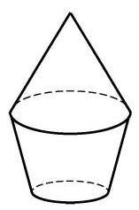
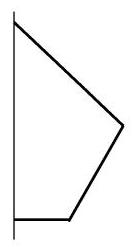
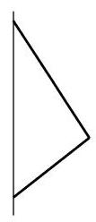
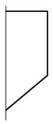
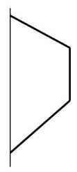
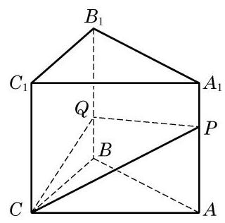

# 概念卡：A 组

1. 如图, 该几何体是由哪个平面图形旋转得到的？画出其余平面图形旋转得到的几何体.

(第 1 题)

(A)

(B)

(C)

(D)

2. 判断下列命题是否正确，并说明理由:

(1)以直角三角形的一直角边为轴旋转所形成的旋转体是圆锥；

(2)以直角梯形的一腰为轴旋转所形成的旋转体是圆台；

(3)圆柱、圆锥、圆台都有两个底面；

(4)圆锥的侧面展开图为扇形，这个扇形所在圆的半径等于圆锥底面圆的半径.

3. 已知一个圆锥的侧面展开图恰是一个半圆. 用通过圆锥的轴的平面截此圆锥, 求截面三角形的顶角.

4. 过圆锥高的三等分点分别作平行于底面的截面, 求它们把圆锥侧面分成的三部分的面积之比.

5. 在棱长为 1 的正方体上，用过同一顶点的三条棱中点的平面分别截该正方体，截去 8 个三棱锥. 求剩下的几何体的体积.

(第 8 题)

6. 已知长方体一个顶点上的三条棱长分别是 $3\text{ 、 }4\text{ 、 }5$ ,且它的 8 个顶点都在同一球面上. 求这个球的表面积.

7. 在等边圆柱 (底面直径等于高的圆柱) 、球、正方体的体积相等的情况下,讨论它们的表面积的大小关系.

8. 如图,在三棱柱的侧棱 ${A}_{1}A$ 和 ${B}_{1}B$ 上分别取 $P\text{ 、 }Q$ 两点, 使 ${PQ}$ 平分侧面 ${AB}{B}_{1}{A}_{1}$ 的面积. 求平面 ${PQC}$ 把棱柱所分成的两部分的体积之比.

9. 已知用通过圆锥的轴的平面去截一个圆锥, 得到的截面是面积为 $9\sqrt{3}{\mathrm{\;{cm}}}^{2}$ 的正三角形. 求此圆锥内接球的半径.
