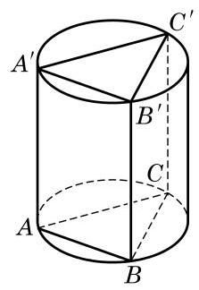
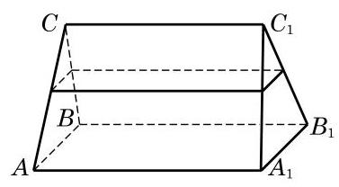

# 概念卡：B 组

1. 已知长方体 ${ABCD} - {A}_{1}{B}_{1}{C}_{1}{D}_{1}$ 的对角线 $A{C}_{1}$ 的长是 $l$ ,且直线 $A{C}_{1}$ 与长方体经过点 $A$ 的三个面所成角分别是 $\alpha \text{ 、 }\beta \text{ 、 }\gamma$ . 求此长方体的体积.

2. 如图, 设圆柱有一个内接棱柱(即棱柱的侧棱都是圆柱的母线, 棱柱的两个底面分别在圆柱的两个底面内). 已知圆柱的体积是 $4\sqrt{3}\pi$ ,棱柱的底面是边长为 2 的正三角形. 求棱柱的体积.

(第 2 题)

(第 3 题)

3. 如图,一个直三棱柱形容器中盛有水,且侧棱 $A{A}_{1} = 8$ . 当侧面 $A{A}_{1}{B}_{1}B$ 水平放置时,液面恰好过 ${AC}\text{ 、 }{BC}\text{ 、 }{A}_{1}{C}_{1}\text{ 、 }{B}_{1}{C}_{1}$ 的中点. 当底面 ${ABC}$ 水平放置时,液面高为多少?
