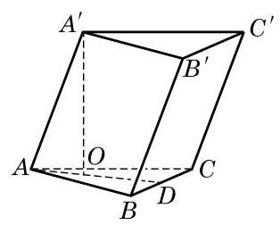
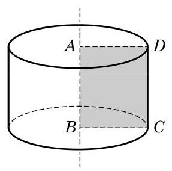

# 例题卡：例 1 已知斜三棱柱 ${ABC} - {A}^{\prime }{B}^{\prime }{C}^{\prime }$ 的底面是正三角形,侧棱 $A{A}^{\prime } \bot  {BC}$ ,并且与底面所成角是 ${60}^{ \circ  }$ . 设侧棱长为 $l$ .

例 1 已知斜三棱柱 ${ABC} - {A}^{\prime }{B}^{\prime }{C}^{\prime }$ 的底面是正三角形,侧棱 $A{A}^{\prime } \bot  {BC}$ ,并且与底面所成角是 ${60}^{ \circ  }$ . 设侧棱长为 $l$ .

(1)求此三棱柱的高；

(2)求证:侧面 $B{B}^{\prime }{C}^{\prime }C$ 是矩形；

(3)求证: ${A}^{\prime }$ 在平面 ${ABC}$ 上的射影 $O$ 在 $\angle {BAC}$ 的平分线上.

解(1)如图 11-1-2,过 ${A}^{\prime }$ 作 ${A}^{\prime }O$ 垂直于平面 ${ABC}, O$ 为垂足,则线段 ${A}^{\prime }O$ 的长就是三棱柱的高, $\angle {A}^{\prime }{AO}$ 就是侧棱 $A{A}^{\prime }$ 与底面所成角.

由 $\angle {A}^{\prime }{AO} = {60}^{ \circ  }, A{A}^{\prime } = l$ ,可得三棱柱的高 ${A}^{\prime }O = l\sin {60}^{ \circ  } \; = \frac{\sqrt{3}}{2}l$ .

(2)由棱柱的定义，可知侧面 $B{B}^{\prime }{C}^{\prime }C$ 是平行四边形. 又因为 $A{A}^{\prime } \bot  {BC}, A{A}^{\prime }//B{B}^{\prime }$ ,所以 $B{B}^{\prime } \bot  {BC}$ ,所以侧面 $B{B}^{\prime }{C}^{\prime }C$ 是矩形.

(3)因为 $A{A}^{\prime } \bot  {BC}$ ， ${A}^{\prime }O$ 垂直于平面 ${ABC}$ ，由三垂线定理,知 ${AO} \bot  {BC}$ . 延长 ${AO}$ 交 ${BC}$ 于点 $D$ ,则 ${AD}$ 是 $\bigtriangleup {ABC}$ 的边 ${BC}$ 上的高. 因为 $\bigtriangleup {ABC}$ 是正三角形,所以 ${AD}$ 也是 $\angle {BAC}$ 的平分线,即 ${A}^{\prime }$ 在平面 ${ABC}$ 上的射影在 $\angle {BAC}$ 的平分线上.

如图 11-1-3, 将矩形 ABCD 绕其一条边 AB 所在直线旋转一周,所形成的几何体叫做圆柱 (cylinder), ${AB}$ 所在直线叫做该圆柱的轴,线段 ${AD}$ 和 ${BC}$ 分别旋转而成的圆面叫做该圆柱的底面, 线段 ${CD}$ 旋转而成的曲面叫做该圆柱的侧面， ${CD}$ 叫做该圆柱的母线,圆柱的两个底面间的距离(即 ${AB}$ 的长度)叫做该圆柱的高.

根据圆柱的形成过程, 易知圆柱有两个相互平行的底面, 有无穷多条母线, 且所有母线都与其轴平行.

方便起见, 我们把棱柱和圆柱统称为柱体.
