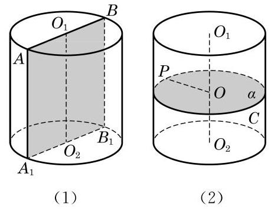

# 例题卡：例 2 证明: (1) 过圆柱的轴的任意平面与圆柱形成的截面都是全等的矩形;

例 2 证明: (1) 过圆柱的轴的任意平面与圆柱形成的截面都是全等的矩形;

(2)任一平行于圆柱底面的平面与圆柱形成的截面都是与底面全等的圆.

证明(1)设过圆柱的轴 ${O}_{1}{O}_{2}$ 的任一平面与圆柱相截所形成的截面为 $A{A}_{1}{B}_{1}B$ ,且 ${AB}\text{ 、 }{A}_{1}{B}_{1}$ 都是底面圆的直径,如图 11-1-4(1)所示. 因为圆柱的底面平行，所以由两个平面平行的性质定理, ${AB}//{A}_{1}{B}_{1}$ . 又因为 $A{A}_{1}//{O}_{1}{O}_{2}//B{B}_{1}$ ,所以 $A{A}_{1}{B}_{1}B$ 是平行四边形. 由 ${O}_{1}{O}_{2}$ 垂直于底面,知 $A{A}_{1}$ 垂直于底面,因此 $A{A}_{1} \bot  {A}_{1}{B}_{1}$ . 所以 $A{A}_{1}{B}_{1}B$ 是矩形,其一组对边的长是底面的直径, 另一组对边的长是圆柱的高, 它们都是完全确定的, 即这些截面互相都全等.

(2)任作一个平行于底面并与圆柱相交的平面 $\alpha$ ,把平面 $\alpha$ 截圆柱侧面所形成的封闭曲线记为 $C$ ,设 $P$ 是 $C$ 上的任意一点, 如图 11-1-4(2)所示. 由圆柱的形成过程，知圆柱侧面上任意一点到圆柱的轴的距离都等于圆柱的底面半径,所以 $P$ 到点 $O$ 的距离必等于底面半径,从而 $C$ 所围出的截面是一个与底面全等的圆.
