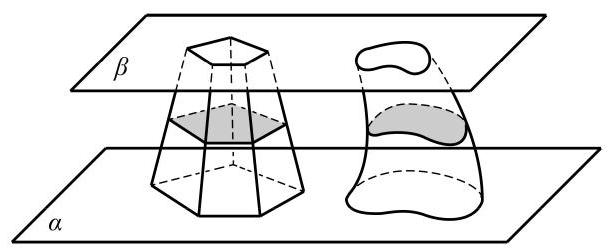
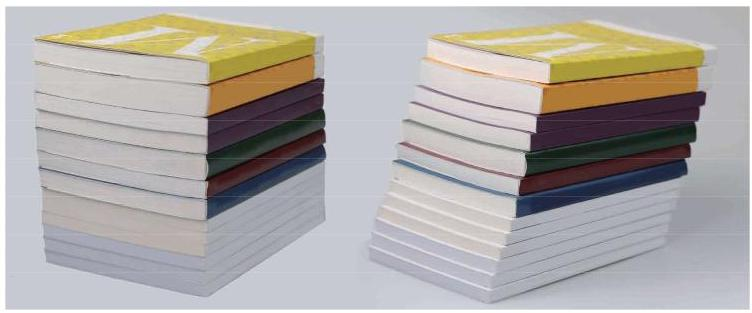
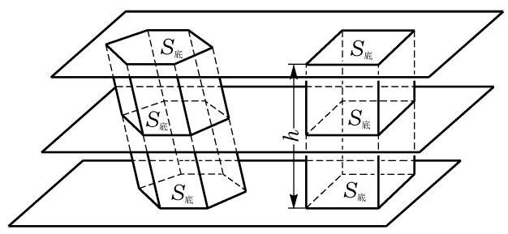

# 方法卡：2 柱体的体积

我们已经知道长方体的体积等于长、宽、高的乘积. 对于一般的柱体, 是否也可以给出相应的体积公式呢?

早在公元 5 世纪，我国数学家祖暅在求球体积时，就创造性地提出了一个原理: “幂势既同，则积不容异. ”这里，“幂”是截面积, “势”是几何体的高. 意思是两个同高的几何体, 若在任意给定的等高处的截面积相等, 则体积相等. 如图 11-1-5, 这个原理可以用现代的数学语言表示如下:

---

“祖暅原理” 是祖冲之(429-500)和他的儿子祖暅(456- 536)提出的, 解决了球体等几何体体积计算问题. 国外用意大利数学家卡瓦列里 (B. Cavalieri, 1598- 1674)的名字命名此原理, 称为 “卡瓦列里原理”.

---

祖暅原理 夹在两个平行平面间的两个几何体, 如果被平行于这两个平面的任意平面截得的两个截面都有相等的面积, 那么这两个几何体的体积必相等.

我们可以把图 11-1-5 看成装满水的两个不同容器. 若在任意给定的等高处液面面积相等, 则容器中的水一样多. 我们还可以用下面的方法直观地解释祖暅原理:如图 11-1-6，取一堆书放在桌面上, 将这堆书如图那样改变一下形状, 这时书堆的高度没有改变, 每页的面积也没有改变, 这堆书的体积与变形前相等.

有了祖暅原理，下面就可以方便地推导一般柱体的体积. 设某个棱柱的底面积是 ${S}_{\text{ 底 }}$ ,高是 $h$ . 为了计算它的体积,我们先构造一个底面积为 ${S}_{\text{ 底 }}$ ,高为 $h$ 的长方体,然后把棱柱和长方体同时置于两个平行平面之间, 如图11-1-7所示.

依据棱柱的定义, 用平行于底面的任意平面去截棱柱所形成的截面与底面多边形全等, 面积自然也相等. 这样, 由祖暅原理可以得到一般棱柱的体积公式:

$$
{V}_{\text{ 棱柱 }} = {S}_{\text{ 底 }}h\text{ . }
$$

其中, ${S}_{\text{ 底 }}$ 为棱柱的底面积, $h$ 为棱柱的高.

用类似的方法可以推导出圆柱的体积公式:

$$
{V}_{\text{ 圆柱 }} = {S}_{\text{ 底 }}h = \pi {r}^{2}h.
$$

其中, ${S}_{\text{ 底 }}$ 为圆柱的底面积, $h$ 为圆柱的高, $r$ 为圆柱的底面半径.
