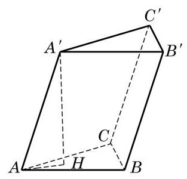

# 例题卡：例 3 已知三棱柱的底面三角形 ${ABC}$ 的三边长分别是 ${AB} = {13}\mathrm{\;{cm}},{BC} = 5\mathrm{\;{cm}},{CA} = {12}\mathrm{\;{cm}}$ ,侧棱 $A{A}^{\prime } = {20}\mathrm{\;{cm}}$ ,且侧棱 $A{A}^{\prime }$ 与底面所成的角为 ${60}^{ \circ  }$ . 求这个三棱柱的体积.

例 3 已知三棱柱的底面三角形 ${ABC}$ 的三边长分别是 ${AB} = {13}\mathrm{\;{cm}},{BC} = 5\mathrm{\;{cm}},{CA} = {12}\mathrm{\;{cm}}$ ,侧棱 $A{A}^{\prime } = {20}\mathrm{\;{cm}}$ ,且侧棱 $A{A}^{\prime }$ 与底面所成的角为 ${60}^{ \circ  }$ . 求这个三棱柱的体积.

解 如图 11-1-8,设 ${A}^{\prime }$ 在平面 ${ABC}$ 上的射影为 $H$ ,则 ${A}^{\prime }H$ 是棱柱的高,且 $\angle {A}^{\prime }{AH} = {60}^{ \circ  }$ .

因为 $\bigtriangleup {A}^{\prime }{AH}$ 是直角三角形,所以

$$
{A}^{\prime }H = {A}^{\prime }A \cdot  \sin {60}^{ \circ  } = {20} \times  \frac{\sqrt{3}}{2} = {10}\sqrt{3}.
$$

又因为 $A{B}^{2} = B{C}^{2} + C{A}^{2}$ ,所以 $\angle C = {90}^{ \circ  }$ . 从而棱柱的底面积 $S = \frac{1}{2} \times  5 \times  {12} = {30}$ .

所以,棱柱的体积 $V = {Sh} = {30} \times  {10}\sqrt{3} = {300}\sqrt{3}\left( {\mathrm{\;{cm}}}^{3}\right)$ .
